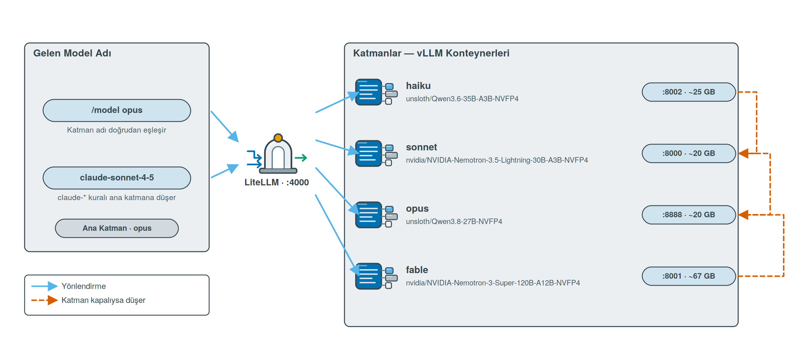
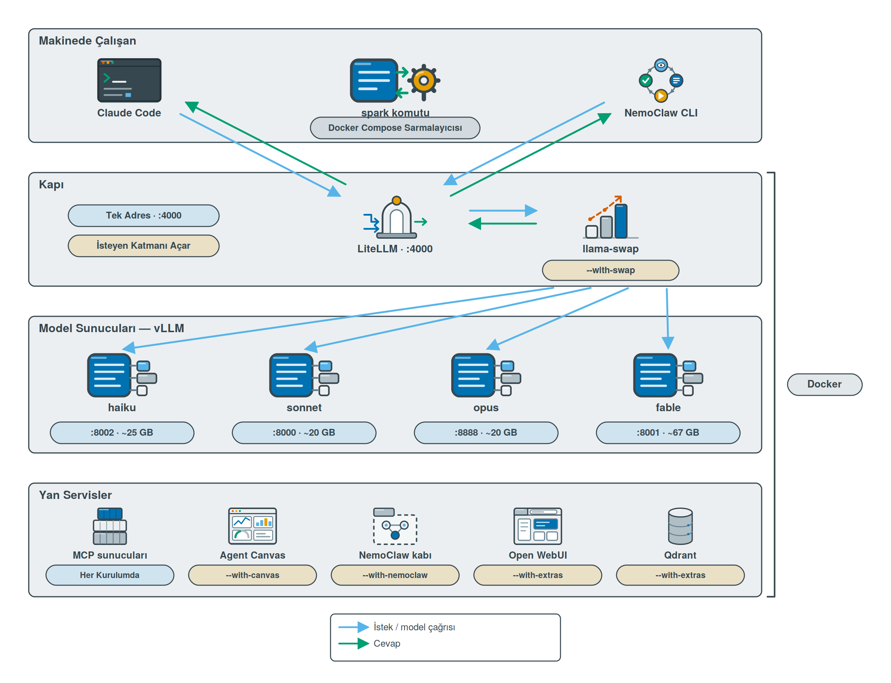
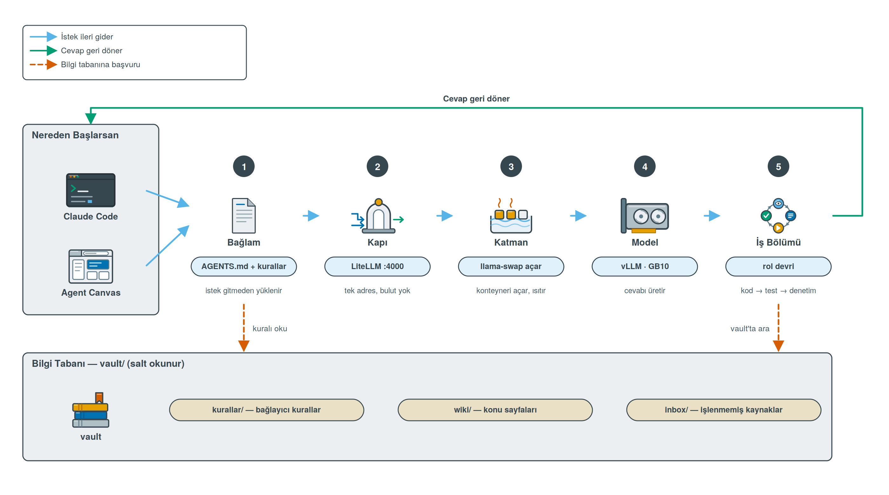
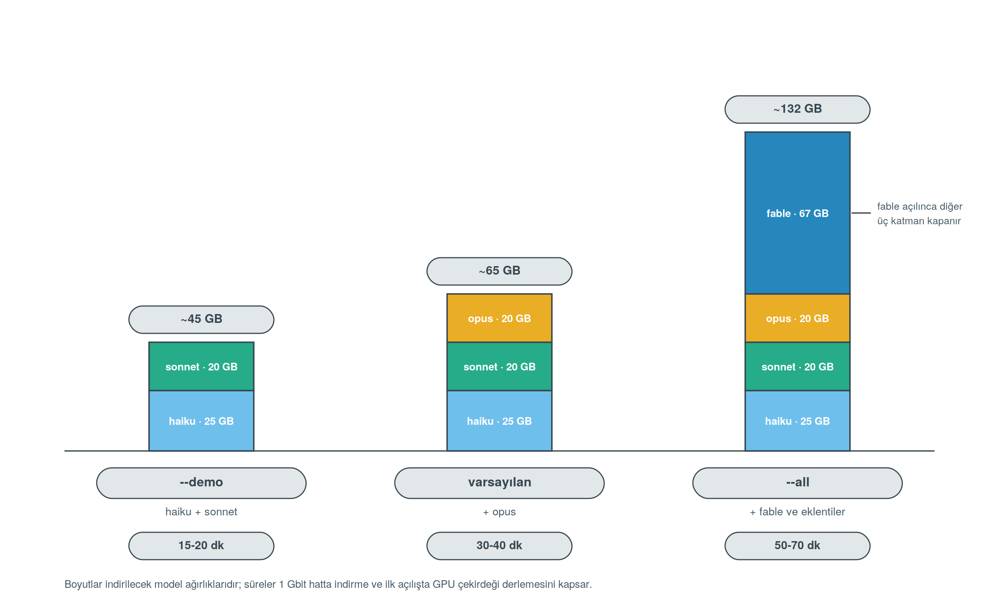
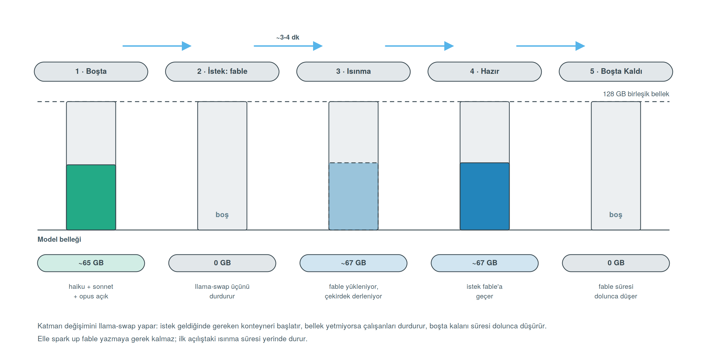
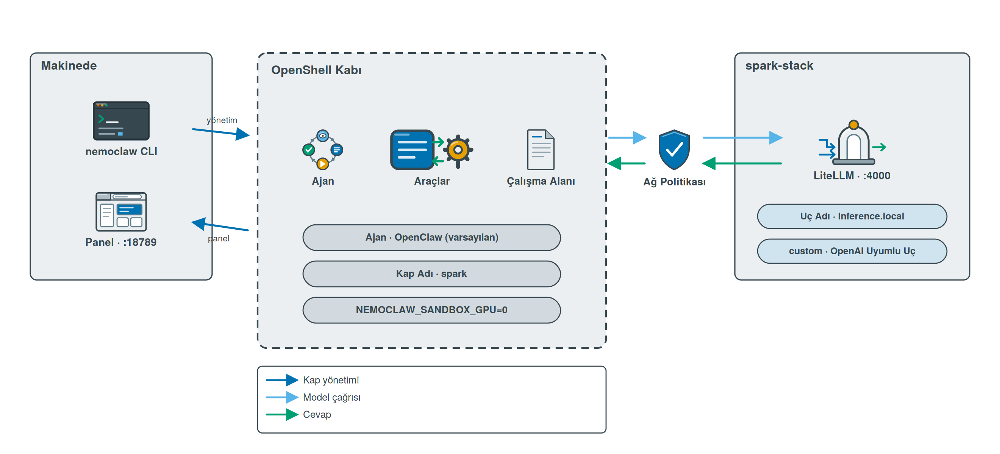
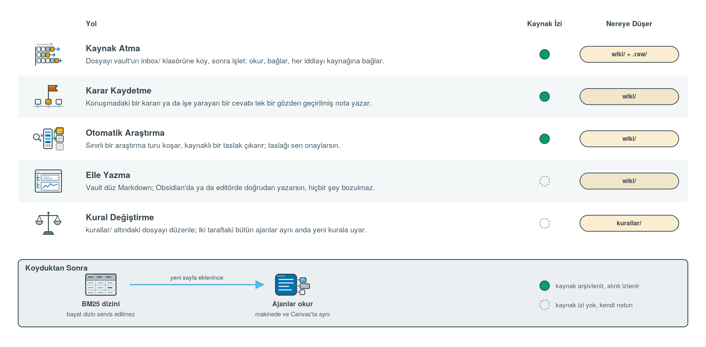

# spark-stack

[](LICENSE)
[-76b900)](https://www.nvidia.com/en-us/products/workstations/dgx-spark/)
[](#)

NVIDIA DGX Spark üzerinde tamamen yerel bir kod asistanı. Dört model katmanı (NVIDIA Nemotron + Qwen), tek API kapısı, Claude Code arayüzü. Buluta hiçbir istek gitmez.

```bash
git clone https://github.com/egerberkuslu/spark-stack
cd spark-stack
bash install.sh --all --token hf_xxx
```

`hf_xxx` yerine kendi HuggingFace anahtarını yaz, çünkü model ağırlıkları oradan iniyor ve
anahtarsız kurulum olmuyor. Ücretsiz almak bir dakika: [huggingface.co](https://huggingface.co)
→ Settings → Access Tokens → Create new token → Type: **Read**.

1 Gbit hatta yaklaşık 50-70 dakika. Adım adım anlatım: **[SETUP.md](SETUP.md)**

Bunu tek kişilik asistan olarak değil, şirketin işlerini yürüten ajan altyapısı olarak
kuracaksan: **[docs/MIMARI.md](docs/MIMARI.md)**: ajan rolleri, ajan başına anahtar ve
bütçe, yalıtım seviyeleri, tek makinenin eşzamanlılık tavanı.

---

## Katmanlar

| Katman | HuggingFace deposu | Aile | Aktif param. | Kullanım | Bellek | Port |
|---|---|---|---|---|---|---|
| `haiku` | `unsloth/Qwen3.6-35B-A3B-NVFP4` | Qwen | 3B (MoE) | Anlık cevap, commit mesajı, dosya özeti | ~25 GB | 8002 |
| `sonnet` | `nvidia/NVIDIA-Nemotron-3.5-Lightning-30B-A3B-NVFP4` + DSpark | NVIDIA | 3B (MoE) | Günlük iş, ajan döngüleri, **~108 tok/s** | ~20 GB | 8000 |
| `opus` | `unsloth/Qwen3.8-27B-NVFP4` + MTP | Qwen | 27B (dense) | Ciddi kod, ajan işleri, **varsayılan** | ~20 GB | 8888 |
| `fable` | `nvidia/NVIDIA-Nemotron-3-Super-120B-A12B-NVFP4` | NVIDIA | 12B (MoE) | En zor işler, **tek başına çalışır** | ~67 GB | 8001 |

İlk üç katman aynı anda açık durur (~65 GB ağırlık + KV cache). `fable` açıldığında diğerleri kapanır.

Claude Code içinde `/model haiku|sonnet|opus` ile geçilir. Kapalı bir katman istenirse LiteLLM isteği çalışan bir katmana yönlendirir, hata dönmez.



Depolar `.env` içinde `HAIKU_REPO`, `SONNET_REPO`, `OPUS_REPO`, `FABLE_REPO` olarak tanımlı. Hangi katmanın hangi modeli çalıştırdığı kurulum boyunca ekranda ve `spark models` çıktısında gösterilir.

### Neden bu dörtlü

**İki aile, iki düşünme tarzı.** Qwen ve NVIDIA Nemotron farklı eğitim felsefelerine sahip; biri takıldığında diğerine geçilir. Her katman kendi ailesinin resmî parser'ıyla çalışır (`hermes`/`qwen3` ve `qwen3_coder`/`nemotron_v3`), aile karışımı yok.

**sonnet = Nemotron 3.5 Lightning.** NVIDIA'nın model kartında DGX Spark için resmî DSpark reçetesi var; bayraklar oradan alındı. DSpark taslak modeliyle Spark'ta ölçülen ~108 tok/s, bu donanımda en yüksek tek-akış hızı. 1M bağlam, OpenMDW lisansı (ticari kullanım serbest).

**opus = Qwen3.8-27B.** Yoğun (dense) 27B; Spark'ın 273 GB/s bant genişliğinde spekülatif decode olmadan ~12 tok/s'de kalır. Checkpoint kendi MTP modülünü içerdiği için `--speculative-config` ile taslak olarak çalışır. Kodda en iyi kalite, ajan araçlarına "developer role" desteği.

**haiku = Qwen3.6-35B-A3B.** 3B aktif MoE, 2.54M indirme. Hafif işler ve sonnet'e Qwen alternatifi.

**fable = Nemotron-3-Super.** NVFP4 ile **ön eğitilmiş** (sonradan kuantize değil), MTP dahili. 12B aktif → ~20 tok/s; ajan döngüsü için değil, tek zor soru için.

**Depo kuralı:** yalnızca birinci taraf (NVIDIA, Qwen) ya da büyük kuantizasyoncu (Unsloth). Tek kişilik/deneysel depo kullanılmıyor, çünkü bozuk bir kuantizasyon Spark'ta sessizce anlamsız çıktı üretir ve fark etmesi zordur.

**Tüm katmanlar NVFP4 + Marlin.** GB10'da (sm_121) stok CUTLASS FP4 çekirdekleri bozuk çıktı üretir; `.env` içindeki `VLLM_NVFP4_GEMM_BACKEND=marlin` bunu engeller.

Alternatif depolar `.env` sonunda yorum olarak listelenmiştir.

---

## Mimari



Makineye kurulan tek bileşen Claude Code'dur (tek dosyalık CLI, terminalde çalışması gerekiyor). Model sunucuları, kapı, veritabanları ve MCP sunucularının tamamı konteynerde çalışır. Sistem Python'una dokunulmaz, aarch64 wheel sorunu yaşanmaz.

---

## Bir promptun hayat öyküsü



Terminaldeki Claude Code'a da yazsan Agent Canvas paneline de yazsan istek aynı beş
duraktan geçer. Diyelim ki "kullanıcı kaydı için bir endpoint yaz" dedin.

**1 · Bağlam.** İstek daha yola çıkmadan üç şey sistem istemine girer: proje kökündeki
`AGENTS.md`, `kurallar/` altındaki dört dosya ve kurulu rollerin listesi. Kuralların
tetikleyicisi yoktur, yani okunup okunmaması ajanın kararına kalmaz; metin zaten oradadır.
Model ilk kelimeyi okumadan şirketin sözleşmesine bağlanmış olur.

**2 · Kapı.** `ANTHROPIC_BASE_URL` yerel kapıyı gösterdiği için istek buluta değil
`localhost:4000`'e gider. LiteLLM tek adrestir: hem OpenAI hem Anthropic yüzeyini konuşur,
tanımadığı bir `claude-*` model adı gelirse ana katmana düşürür.

**3 · Katman.** Kapı isteği llama-swap'a verir, o da katmanın konteyneri kapalıysa açar ve
ısınmasını bekler. Günlük üç katman aynı anda açık kalabilir; `fable` açıldığında üçü birden
kapanır, çünkü 128 GB'a hepsi sığmaz. Bu yüzden `fable` otomasyondan çağrılmaz, insanın
bilerek seçtiği yerdir.

**4 · Model.** vLLM cevabı üretir; ağırlıklar NVFP4, backend Marlin
([neden](#neden-bu-dörtlü)).

**5 · İş bölümü.** İş çok adımlıysa tek ajan baştan sona götürmez. `spark-kod` yazar ve neyin
test edilmesi gerektiğini söyleyerek devreder, `spark-test` testi yazar ve **çalıştırır**,
çıktısını rapora koyar, kırılan testi kendisi düzeltmeyip geri devreder, `spark-denetci`
değişikliğin tamamını okur ve PR açıklamasını hazırlar. PR açılmadan önce kural kapısı koşar:
kapı kapalıysa PR açılmaz. PR açılır ama birleştirilmez; o karar insanındır.

Yol boyunca iki kez bilgi tabanına sapılır: başta kural okunur, sonunda geçmiş bir karar ya da
kaynak gerektiğinde vault'ta aranır. Vault iki tarafta da salt okunur bağlıdır, yani ajan okur
ama yazmaz.

Nereden başladığın yalnızca ilk adımı değiştirir. Roller, kurallar, skill'ler ve bilgi tabanı
iki tarafta da aynıdır; ayrıntı [aşağıda](#nereden-çalışırsan-çalış-aynı-sistem).

---

## Kurulum seçenekleri

> **Her kurulum HuggingFace anahtarı ister**, `--demo` dahil, `--all` dahil. Model
> ağırlıkları oradan iniyor, anahtarsız hiçbir katman inmez. Ücretsiz: [huggingface.co](https://huggingface.co)
> → Settings → Access Tokens → **Create new token** → Type: **Read**. Sonra `hf_` ile başlayan
> değeri `--token` ile ver; vermezsen kurulum sorar ve `hf_` ile başlamayan bir değeri kabul etmez.

```bash
bash install.sh --demo --token hf_xxx   # haiku + sonnet            ~45 GB    15-20 dk
bash install.sh --token hf_xxx          # + opus                    ~65 GB    30-40 dk
bash install.sh --all --token hf_xxx    # dört katman + eklentiler ~132 GB    50-70 dk
```



| Bayrak | Açıklama |
|---|---|
| `--token hf_xxx` | **Zorunlu.** HuggingFace anahtarı; verilmezse kurulum sorar |
| `--with-fable` | Dördüncü katman |
| `--with-extras` | Open WebUI, Qdrant, Whisper |
| `--with-wiki` | Obsidian + claude-obsidian bilgi tabanı |
| `--with-nemoclaw` | NVIDIA NemoClaw ajan kabı (`--all` içinde) |
| `--with-swap` | llama-swap: katmanı istek anında aç (`--all` içinde) |
| `--with-canvas` | Agent Canvas ajan kontrol merkezi (`--all` içinde) |
| `--with-a2a` | A2A köprüsü: rolleri protokolle aç (`--all` içinde) |
| `--with-agency` | agency-agents kataloğu + 15 uzman rol (`--all` içinde) |
| `--projects PATH` | Canvas ajanının göreceği klasör (varsayılan `~/projects`) |
| `--vault PATH` | Vault yolu (varsayılan `~/vault`) |
| `--resume` | Yarım kalan kurulumu sürdür |
| `--status` / `--uninstall` | Durum / kaldırma |

---

## Sıfır makineden başlar

Hiçbir şey kurulmamış bir Spark varsayılır. Script eksik olanı kurar, kurulu olanı atlar:

| Bileşen | Davranış |
|---|---|
| curl, jq, git, gnupg | Eksikse apt ile kurulur |
| NVIDIA sürücüsü | Eksikse kurulur, yeniden başlatma istenir, `--resume` ile devam edilir |
| Docker Engine + Compose v2 | Eksikse Docker'ın resmî deposundan kurulur |
| NVIDIA Container Toolkit | Eksikse kurulur, `nvidia-ctk` ile Docker'a tanıtılır |
| docker grubu | Kullanıcı eklenir; oturumda etkin değilse kurulum `sudo docker` ile sürdürülür |

Son adımda konteynerden `nvidia-smi` çalıştırılarak GPU erişimi fiilen doğrulanır.

> DGX OS bu bileşenlerin çoğunu hazır getirir; o durumda adım birkaç saniye sürer.

---

## Günlük kullanım

```bash
spark status                # servis durumu, bellek, disk
spark swap                  # llama-swap: hangi katman ayakta
spark canvas                # Agent Canvas adresi ve ayarları
spark a2a                   # A2A köprüsü: kart ve roller
spark agents --kurulu       # kurulu uzman roller
spark agents                # ekle/çıkar (etkileşimli)
spark kural pr              # PR kapısı: kurallar, testler, açıklama
spark anahtarlar            # ajan anahtarları: harcama, bütçe, model izni
spark up canvas             # kontrol merkezini aç
spark up swap               # llama-swap düzenini aç
spark up demo               # haiku + sonnet
spark up daily              # haiku + sonnet + opus
spark up fable              # yalnız fable
spark up extras             # Open WebUI :3000, Qdrant :6333
spark logs opus             # canlı log
spark ask "merhaba" sonnet  # hızlı test
spark pull opus             # katman ağırlığı indir
spark models                # katman → model eşlemesi ve durum
spark update                # imajları güncelle
spark down                  # tümünü durdur
```

---

## Ne kuruluyor

| Bileşen | Detay |
|---|---|
| Model katmanları | vLLM, NVFP4, Marlin backend, prefix caching, FP8 KV cache |
| LiteLLM | Tek adres, Anthropic ↔ OpenAI çevirisi, katman fallback'i, kullanım logu |
| llama-swap | Katmanı istek anında açar, çakışanı kapatır, boştayı düşürür · `--with-swap` |
| Claude Code | Yerel kapıya bağlı; telemetri ve bulut erişimi kapalı |
| MCP sunucuları | filesystem, git, fetch, context7, playwright, memory, sequential-thinking, hepsi konteyner |
| Skill'ler | Superpowers (TDD, sistematik hata ayıklama, plan çıkarma) |
| Bilgi tabanı | Obsidian + claude-obsidian (15 skill) · `--with-wiki` |
| Ajan kabı | NVIDIA NemoClaw + OpenShell, model yerel kapıdan · `--with-nemoclaw` |
| Kontrol merkezi | Agent Canvas: konuşmalar, otomasyonlar, ACP alt ajanları · `--with-canvas` |
| A2A köprüsü | Rolleri Agent2Agent protokolüyle dışarı açar · `--with-a2a` |
| Kural kapısı | git kancaları, PR kapısı, CI şablonu; ruff, pytest ve shellcheck kendi sanal ortamında |
| Kapı veritabanı | Postgres; ajan başına anahtar, günlük bütçe, model izni |
| Ekstralar | Open WebUI, Qdrant, Whisper · `--with-extras` |

---

## Portlar

Hepsi varsayılan olarak `127.0.0.1`'e bağlıdır; hiçbiri kurulumdan sonra kendiliğinden ağa açılmaz.

| Port | Servis | Ne zaman açılır | Değiştir |
|---|---|---|---|
| `4000` | **LiteLLM kapı**, tek API adresi | her zaman | `GATEWAY_BIND` |
| yok | **Kapı veritabanı** (Postgres) · anahtar, bütçe, harcama · yalnız konteyner ağında | her zaman | bağlanmaz |
| `8002` | `haiku` (vLLM) | `demo`, `daily` | yok |
| `8000` | `sonnet` (vLLM) | `demo`, `daily` | yok |
| `8888` | `opus` (vLLM) | `daily` | yok |
| `8001` | `fable` (vLLM) | `fable` | yok |
| `8081` | llama-swap durum ucu | `--with-swap` | `SWAP_PORT` |
| `8300` | **Agent Canvas** paneli (OpenHands'in bugünkü adı) | `--with-canvas` | `CANVAS_PORT`, `CANVAS_BIND` |
| `8400` | A2A köprüsü | `--with-a2a` | `A2A_PORT`, `A2A_BIND` |
| `8080` | NemoClaw OpenShell gateway | `--with-nemoclaw` | NemoClaw yönetir |
| `18789` | NemoClaw paneli | `--with-nemoclaw` | NemoClaw atar |
| `3000` | Open WebUI | `--with-extras` | `WEBUI_BIND` |
| `6333` | Qdrant | `--with-extras` | yok |
| `9000` | Whisper | `stt` profili | yok |

İki tanesi bilerek kaydırıldı. Agent Canvas kendi içinde 8000 dinler ama o portu `sonnet` kullandığı için dışarı 8300'den açılır. llama-swap da 8080 yerine 8081'e alındı, çünkü 8080 NemoClaw'ın OpenShell gateway'inin varsayılanı ve `--all` ile ikisi birden kurulduğunda çakışırlardı.

---

## Ne neye bağlı

Parçalar kendiliğinden birbirine bağlanır; aşağıdaki her satır kurulumun yazdığı bir ayardır,
elle yapılan bir iş değil.

| Bileşen | Modele nasıl ulaşır | Kuralları alır mı | Vault'ta araştırabilir mi |
|---|---|---|---|
| Claude Code (makinede) | `.bashrc` → `:4000`, anahtar `KEY_INSAN` (fable dahil) | evet | evet: `~/vault` + vault MCP + `wiki` |
| Agent Canvas | ayar API'siyle tohumlanır → `litellm:4000`, anahtar `KEY_CANVAS` (fable yok, bütçeli) | evet | evet: `/vault` salt okunur |
| Claude Code (Canvas içinde, ACP) | `ANTHROPIC_BASE_URL` → `litellm:4000`, anahtar `KEY_CANVAS` | evet | evet: `/vault` salt okunur |
| A2A köprüsü | `A2A_GATEWAY_URL` → `litellm:4000/v1`, anahtar `KEY_A2A` | evet | kısmen: yol sistem isteminde, dosya aracı çağırana bağlı |
| Open WebUI | `OPENAI_API_BASE_URL` → `:4000/v1` | ilgisiz | hayır |
| NemoClaw | `NEMOCLAW_ENDPOINT_URL` → `:4000/v1`, anahtar `KEY_NEMOCLAW` | **hayır** | **hayır**: aşağıya bak |
| llama-swap | katmanlara servis adıyla (`haiku:8000`) | ilgisiz | hayır |
| Kural kapısı | model kullanmaz | zorlar: ölçülebilir kurallar burada durur | hayır |

### Nereden çalışırsan çalış aynı sistem

Amaç şu: makinedeki Claude Code'da mı yazıyorsun, Canvas panelinde mi: aynı roller, aynı
kurallar, aynı skill'ler, aynı bilgi tabanı. Bugün duran tablo:

| | makinede Claude Code | Agent Canvas |
|---|---|---|
| `spark-*` roller | `~/.claude/agents` | `~/.openhands/agents` |
| `ajans-*` roller | aynı | aynı |
| Kurallar | skill + rol gövdesi | her-zaman-aktif skill + `AGENTS.md` + rol |
| Bilgi tabanı okuma | `~/vault` | `/vault` salt okunur |
| claude-obsidian'ın 15 skill'i | eklenti olarak | **ortak skill dizininde** |
| Host skill'leri (superpowers vb.) | `~/.claude/skills` | **ortak skill dizininde** |
| Kural kapısı | `core.hooksPath` ile her depo | `GIT_CONFIG_*` ile aynı kancalar |
| MCP sunucuları | yedisi de | **yok**: aşağıya bak |

Skill birliğini `roller/skill-birlestir.sh` kuruyor: kurallar, claude-obsidian skill'leri ve
`~/.claude/skills` altındaki her şey tek dizinde birleşiyor, compose onu kaba
`~/.agents/skills` olarak bağlıyor. Biçim iki tarafta da aynı (`SKILL.md` + frontmatter), o
yüzden dönüştürme gerekmiyor. claude-obsidian skill'lerindeki `PRODUCT_ROOT` yer tutucusu
kaptaki `/opt/claude-obsidian` yoluna sabitleniyor, böylece `wiki-query` ve `wiki-retrieve`
Canvas'ta da çalışıyor, yani vault araması artık iki tarafta da aynı hattan geçiyor.

Dizin her kurulumda sıfırdan derleniyor; makinede sildiğin bir skill kapta kalmıyor.

**MCP'de eşitlik sağlanamıyor ve sebebi yapısal.** Canvas MCP'yi destekliyor (`stdio` ve
`url` biçimleri var), ama bizim yedi sunucumuz `docker run` ile çalışan stdio sunucuları ve
kabın içinde docker yok, olmasını da istemiyoruz, yalıtımı zayıflatırdı. Kaptaki ajanın
dosya, kabuk ve arama araçları zaten yerleşik, yani `filesystem` ve `git` MCP'leri orada
gereksiz. Gerçekten eksik kalan `fetch`, `context7` ve `playwright` gibi dışarıya çıkanlar;
onlara ihtiyaç duyan işi makinedeki Claude Code'a bırakmak doğru olur. Bunları kapta da
istersen yol belli: her birini HTTP/SSE konuşan bir compose servisi olarak çalıştırıp Canvas'a
`url` ile tanıtmak gerekir.

**Ajanlar vault'ta nasıl araştırıyor.** Erişim tek başına yetmiyordu: kaplara vault bağlıydı
ama hiçbir şey ajana oraya bakmasını söylemiyordu. Artık kural metni, rol gövdeleri ve
`AGENTS.md` vault'un yapısını anlatıyor: `wiki/index.md` konu haritası, `wiki/log.md` kararlar,
`inbox/` işlenmemiş kaynaklar. Ayrıca geçmiş bir karara dayanan her cevapta önce oraya bakmasını,
dayandığı sayfayı söylemesini, kayıt yoksa "vault'ta kayıt yok" demesini şart koşuyor.

Host tarafında bunun üstüne claude-obsidian'ın kendi getirme hattı var (BM25 dizini, `wiki-query`,
`wiki-retrieve`); `wiki "auth kararı neydi?"` onu kullanır. Kaplardaki ajanlar o hatta sahip
değil, düz dosya araması yapar; aynı içeriğe ulaşır, sıralama daha kaba olur.

**NemoClaw kuralları almıyor ve bu bilinçli.** O kap dışarıdan gelen isteği karşılayan, en az
güvenilen giriş noktası; bilgi tabanını oraya bağlamak istenmedi. Gerekirse
`nemoclaw onboard --host-mount ~/vault/kurallar:/vault/kurallar` ile salt okunur bağlanabilir,
ama varsayılan kapalı. Yani NemoClaw'a verilen iş, kuralların uygulanmasının beklenmediği iş
olmalı.

---

## Kural kapısı

Kurallar yalnız istemde durmaz; ölçülebilir olan her kural mekanik olarak da zorlanır.
`kurallar/*.md` dosyalarının sonundaki "Mekanik denetim" tablosu hangi satırın kapıda, hangisinin
`spark-denetci` incelemesinde olduğunu söyler. Kapı üç yerde durur ve üçü aynı betiktir
(`roller/denetim/kural_kapisi.py`, saf Python):

| Yer | Ne zaman | Ne bakar |
|---|---|---|
| git kancaları | her commit ve itme; makinede ve Canvas kabında | dal adı, `.env`, sır taraması, ruff (biçim, tip ipucu, hata yönetimi, yapı), test dosyası kuralları, shellcheck, uzun tire, commit mesajı, zorla itme |
| `spark kural pr` | PR açılmadan ve birleştirilmeden önce | üsttekilerin hepsi, `pytest` yeşil mi, PR açıklamasında üç başlık ve çalıştırılan komut |
| CI | GitHub'da PR açılınca | aynı kapı, `.kural/` kopyasıyla |

Makinede `core.hooksPath` bütün depoları kapıya bağlar: insanın commit'i de Claude Code'un commit'i
de aynı kapıdan geçer. Canvas kabı aynı dizini `/opt/spark-denetim` olarak görür ve `GIT_CONFIG_*`
ile aynı kancalara bağlanır; ruff ve shellcheck ikilileri de o dizinde durduğu için kapta ayrıca
kurulum gerekmez.

Her bulgu kural dosyasını ve bölümünü söyler, gerekçesiz bulgu yoktur:

```
kural kapısı: 3 engelleyici, 1 uyarı → kapı KAPALI
  ✗ kod-standartlari.md › Hata yönetimi   src/app.py:7          Do not use bare `except`  (E722)
  ✗ test-kurallari.md › Biçim             tests/test_app.py:5   test adı ne yaptığını söylemiyor: test_1
  ✗ pr-kurallari.md › Commit              commit mesajı         ilk satır küçük harfle başlamalı
```

Kaçış yolu var ama kayıtlı: `KURAL_KAPISI_ATLA=1 git commit` kapıyı bir kerelik atlar; kim, hangi
dal, ne zaman `denetim/atlama.log` dosyasına yazılır ve `spark kural durum` gösterir. `git
--no-verify` kancaları geçer, PR kapısı ve CI aynı denetimi yeniden koşturur.

Projeye CI ve PR şablonu: `spark kural kur <proje>`. CI vault'u okuyamadığı için kural kopyası
`.kural/` altına konur; kopya vault'tan farklıysa kapı uyarır. Ayar kuralların yanında durur
(`kurallar/denetim/ruff.toml`): kural değişince önce metin, sonra ayar değişir, ikisi aynı klasörde
olduğu için birlikte eskimezler.

Kapı 13 senaryoluk bir deneme deposunda gerçek git kancalarıyla test edildi: `main` üzerinde
commit, boş `except`, kodda AWS anahtarı, `.env`, `test_1`, üç iddialı test, gerekçesiz `skip`,
testte `datetime.now`, uzun tire, soru başlık, büyük harfli commit mesajı, 60 karakter, amend
sonrası `--force`, başlıksız PR açıklaması. Hepsi durdu; düzeltilmiş halleri geçti.

---

## Anahtarlar, bütçe ve model izni

Kapının bir veritabanı var (`sk-litellm-db`, Postgres). Kurulum dört anahtar üretir ve `.env`
içine yazar:

| Anahtar | Kim kullanır | Modeller | Günlük bütçe |
|---|---|---|---|
| `KEY_INSAN` | terminaldeki Claude Code, yani sen | hepsi, fable dahil | yok |
| `KEY_CANVAS` | Agent Canvas ve içindeki Claude Code | haiku, sonnet, opus, `claude-*` | 20M token |
| `KEY_NEMOCLAW` | NemoClaw kabı | aynı | aynı |
| `KEY_A2A` | A2A köprüsü | aynı | aynı |

İki sonuç var. Birincisi, **otomasyon fable'ı açamaz.** llama-swap'ta fable dışlayıcıdır,
açıldığında günlük üç katman düşer; bir otomasyonun bunu tetiklemesi eş zamanlı çalışan diğer
ajanların modelini altından çekerdi. Kapı bu isteğe 403 döner, insan anahtarı geçer. İkincisi,
**döngüye giren ajan durur.** Bütçe dolunca kapı 429 döner, makine bütün gün meşgul kalmaz. Yerel
modelin parası olmadığı için maliyet nominal tutulur, 1 $ = 1M token; bütçe günlük sıfırlanır
(`OTOMASYON_GUNLUK_MTOKEN`, varsayılan 20).

`spark anahtarlar` harcamayı, kalan bütçeyi ve model iznini gösterir. Kurulumun doğrulama adımı
canvas anahtarıyla fable isteyip 403 gördüğünü raporlar. Anahtar üretilemezse herkes ana
anahtarla devam eder ve doğrulama bunu açıkça eksik yazar; sessizce "çalışıyor" demez.

Bu mekanizma sahte arka uçlu bir kapıda uçtan uca doğrulandı: model izni 403, bütçe aşımı 429,
`claude-*` jokeri, `all-proxy-models` ve iki dağıtım arasında yük dağıtımı.

---

## Bellek yönetimi

Spark'ta 128 GB bellek CPU ve GPU arasında paylaşılır. Sığmayan bir model makineyi kilitler; yavaşlatmaz, kilitler.

| Profil | Açık katmanlar | Yaklaşık |
|---|---|---|
| `demo` | haiku + sonnet | ~45 GB |
| `daily` | haiku + sonnet + opus | ~65 GB |
| `fable` | fable | ~67 GB |

`spark status` çıktısında kullanım 120 GB'yi geçmemeli. Geçerse `/srv/ai/compose/.env` içindeki ilgili `*_MEM` değeri 0.05 düşürülüp `spark up daily` çalıştırılır.

GB10'da `nvidia-smi --query-gpu=memory.*` çoğu sürümde `Not Supported` döner: bellek GPU'ya ayrılmış değil, CPU ile ortaktır. `spark` bunu görünce `/proc/meminfo` üzerinden okur, o yüzden `Bellek` satırı kimi makinede GiB cinsinden birleşik kullanım gösterir. Ölçtüğün sayı aynı sayıdır, yalnızca kaynağı değişir.

`gpu_memory_utilization` toplamı 0.75'in üzerine çıkarılmamalı; topluluk raporlarında 0.8 üstü değerler kilitlenmeye yol açıyor.

---

## Katman değişimi: llama-swap

`--with-swap` (ya da `--all`) ile [llama-swap](https://github.com/mostlygeek/llama-swap) kapı ile model sunucuları arasına girer. `spark up fable` yazmaya gerek kalmaz: Claude Code içinde `/model fable` dersin, llama-swap çakışan katmanları kapatır, fable'ı açar, boşta kalanı süresi dolunca düşürür.



```bash
spark up swap     # llama-swap düzenini aç
spark swap        # hangi katman ayakta, bellek ne durumda
```

Kurulum bittiğinde ana katman bir kez ısıtılır, böylece ilk gerçek isteğin beklemez.

**Nasıl kurulu.** Konteynerleri compose oluşturur ama başlatmaz; llama-swap yalnızca `docker start` / `docker stop` eder. Böylece bütün vLLM bayrakları `docker-compose.yml` ve `.env` içinde tek yerde kalır, llama-swap tarafında kopyası olmaz. Grup kuralı belleğin gerçeğini yansıtır: `haiku + sonnet + opus` birlikte durur, `fable` açılınca üçü de düşer.

| Ayar | Varsayılan | Ne yapar |
|---|---|---|
| `SWAP_TTL` | `1800` | Bir katman kaç saniye boşta kalınca düşer |
| `SWAP_TTL_<KATMAN>` | yok | Katman başına ayrı süre (`SWAP_TTL_FABLE=900`) |
| `SWAP_HEALTH_TIMEOUT` | `2100` | İlk açılışta çekirdek derlemesi için tanınan süre |
| `SWAP_BIND` | `127.0.0.1` | llama-swap'in dinlediği adres |

**Üç dürüst not.**

İlk açılış hâlâ 3-4 dakika sürüyor; llama-swap bunu ortadan kaldırmıyor, yalnızca ne zaman olacağına kendisi karar veriyor. Soğuk bir katmana ilk kez geçerken Claude Code kendi zaman aşımına takılabilir; o katmanı önce `spark ask "merhaba" fable` ile ısıtmak bu sorunu bitirir.

llama-swap'in Docker API istemcisi yok; komutu düz `exec` ediyor. Bu yüzden konteynere hem `docker.sock` hem de statik `docker` CLI ikilisi bağlanıyor ve konteyner host'un `docker` grubuna alınıyor. Soketi görebilen bir konteyner pratikte makinede root demektir; makineyi ekibe açıyorsan bunu bilerek yap.

llama-swap'te kimlik doğrulama yok. Bu yüzden `SWAP_BIND` varsayılan olarak `127.0.0.1`; kapı (LiteLLM) ona ağ içinden `llamaswap:8080` ile ulaştığı için dışarı açmaya gerek de yok. Ekibe açarken açman gereken tek şey kapının kendisi.

**Grup kuralı hakkında bir uyarı.** Aynı yığını kuran bir topluluk deposu grup kuralını kapatmış; gerekçesi, beklenmedik model değişimlerinin ölçüm koşularını bozmasıydı. Bizde grup kuralı asıl işi yapan şey (üç katmanın birlikte durabilmesi onunla mümkün), o yüzden açık bırakıldı. Uzun bir karşılaştırma koşusu yapacaksan `/srv/ai/compose/llamaswap.yaml` içindeki `routing:` bloğunu kaldır; llama-swap o zaman tek model kuralına döner, katmanlar birbirini beklemez ama aynı anda yalnız biri ayakta kalır.

---

## Ekibe açmak

Kapı varsayılan olarak yalnızca yerel makineden erişilebilir. Ağa açmak için `/srv/ai/compose/.env`:

```
GATEWAY_BIND=0.0.0.0
LITELLM_KEY=<uzun-bir-anahtar>
```

`spark up daily` ile yeniden başlatılır. İstemci tarafında: OpenAI uyumlu uç `http://<spark-ip>:4000/v1`, model adı `opus`. Claude Code için `ANTHROPIC_BASE_URL=http://<spark-ip>:4000`.

Ofis dışı erişim için Tailscale önerilir, çünkü port açmayı ve sabit IP'yi gerektirmez.

---

## Ajanlar arası işbirliği

Aynı kapıdan geçen iki ajan hâlâ birbirinden habersiz çalışabilir. İşbirliğini kuran şey ortak
bir sözleşmedir ve o sözleşme bilgi tabanında durur.


Kurallar `~/vault/kurallar/` altında dört dosyadadır: `kod-standartlari.md`, `test-kurallari.md`,
`pr-kurallari.md`, `yazim-kurallari.md`. Kurulum bunları taslak olarak koyar, varsa üzerine
yazmaz. **Hiçbir ajan tanımı bu metni kopyalamaz, yerini gösterir**: kopya eskir, tek kaynak
eskimez. Bir kuralı vault'ta değiştirdiğinde bütün ajanlar o an yeni kurala bağlanır.

Üç rol kurulur ve kimse kendi işini onaylamaz:

| Rol | Yapar | Yapmaz |
|---|---|---|
| `spark-kod` | kod yazar, değiştirir | test yazmaz, kendini onaylamaz |
| `spark-test` | test yazar ve **çalıştırır** | kodu düzeltmez, geri devreder |
| `spark-denetci` | denetler, PR açıklaması hazırlar | kod yazmaz, **birleştirmez** |

**Kurallar her konuşmada zorunlu olarak yüklenir.** Canvas kabına `kurallar/` klasörü ayrıca
kullanıcı skill'i olarak bağlanır (`~/.agents/skills`, salt okunur). Tetikleyicisi olmayan
`.md` dosyaları sistem istemine tam metin girer, yani kuralı okumak ajanın insafına kalmaz.
Aynı şey proje kökündeki `AGENTS.md` için de geçerli: hem Claude Code hem Canvas onu
kendiliğinden okur ve içeriği tam metin olarak sistem istemine koyar.

**Aynı roller iki tarafta da çalışır.** Kurulum tek kaynaktan iki sürüm üretir: host'taki
Claude Code için `~/.claude/agents/`, Agent Canvas için `/srv/ai/data/canvas/agents/` (kabın
içinde `~/.openhands/agents/`). Canvas her konuşma başlarken bu dizini kendiliğinden tarayıp
rolleri devir kaydına yazar, yani `spark-kod`'a görev verilebilir. İki sürüm arasındaki tek
fark iki alan: kural yolu (`~/vault` / `/vault`) ve model adı (`opus` / `litellm_proxy/opus`).

**Kurulum gerekli ayarı kendi yapar.** Canvas ayağa kalkınca `PATCH /api/settings` ile iki şey
tohumlanır: alt ajan devri açılır (`enable_sub_agents`, varsayılanı kapalıdır ve kapalıyken
devir aracı hiç yüklenmez) ve model yerel kapıya bağlanır. Yazmakla yetinmeyip geri okuyup
doğrular; tutmazsa uyarır ve elle yapılacak adımı yazar. `spark canvas` bu ayarı her seferinde
canlı okuyup gösterir, yani "açık sanıyordum" durumu olmaz.

### Role nasıl görev verilir

Rolü elle "atamazsın"; yönlendiren ajan işi bölüp devreder. Üç yol var:

```
Bırak o karar versin   "ödeme akışına indirim kuponu ekle, testleriyle"
Rolü adıyla iste       "spark-kod'a devret: şu fonksiyonu yaz"
Doğrudan protokolle    curl localhost:8400/agents/spark-kod/a2a/v1 ...
```

Canvas'ta rol listesi konuşma başında kendiliğinden yüklenir; ayrı bir "rol seç" adımı yoktur.
Devrin çalışması için tek koşul `enable_sub_agents` ayarıdır ve onu kurulum açıyor.

### Katalogdan uzman roller

`--with-agency` ile [agency-agents](https://github.com/msitarzewski/agency-agents) (MIT)
kataloğundan seçilmiş 15 uzman rol çekilir: backend/frontend/yazılım mimarı, veritabanı
iyileştirici, DevOps, SRE, olay müdahale, git akışı, teknik yazar, en-az-değişiklik mühendisi,
kod tabanına giriş, API platformu, ürün yöneticisi, sprint önceliklendirici, toplantı notu.

Kataloğun **kendisi** `/srv/ai/agency-agents` altına kurulur; `spark agents` onun resmî
kurucusunu sarar, yani listeleme, etkileşimli seçici ve bütün seçim bayrakları elinde kalır.

```bash
spark agents                    # etkileşimli seçici (ekle/çıkar)
spark agents --liste            # katalogdaki bütün ajanlar
spark agents --kurulu           # sistemde hangileri var, hangi katmanda
spark agents --ekle rust-refactoring-specialist
spark agents --sil  rust-refactoring
spark agents --onerilen         # seçilmiş 15'i (yeniden) kur
```

Her eklemeden sonra uyarlayıcı kendiliğinden çalışır ve üç şeyi ekler: adı slug'a çevirir,
katman adını yazar (host'ta `opus`, Canvas'ta `litellm_proxy/opus`), gövdeye şirket kurallarını
bağlar, yoksa çekilen persona bizim kurallarımızı okumaz. Ayrıca Canvas kopyasını üretir.
Uyarlanmış dosyaya ikinci kez dokunulmaz, tekrar tekrar çalıştırılabilir.

Katman seçimi ajanın işine göre: mimari ve kod yazanlar `opus`, işletme ve olay müdahale
`sonnet`, özet çıkaranlar `haiku`. Adlar `ajans-` önekli, kendi rollerimizle karışmaz.

Kendi rollerimizle çakışanlar (kod yazan, test eden, denetleyen) bilerek dışarıda: onlar bizim
kurallarımıza göre yazıldı, genel bir persona onların yerini almamalı.

**Masaüstü uygulaması (`agency-agents-app`) kurulmuyor, iki sebeple.** Linux ikilileri yalnız
amd64; `aarch64` varlıkları macOS, `arm64-setup.exe` Windows; Spark aarch64 Linux olduğu için
eşleşen ikili yok. Ve zaten gerek de yok: o uygulamanın `tools.json` dosyasında Claude Code
biçimi `identity` olarak tanımlı, yani dosyayı hiç dönüştürmeden kopyalıyor. Sardığımız
`scripts/install.sh` ile aynı işi, üstelik başsız ve bizim kurallarımıza bağlayarak yapıyoruz.

Kuralları düzenlemek için dosyaları doğrudan aç, ya da `wiki` komutuyla bilgi tabanında çalış.

### Roller protokolle de adreslenebilir

Canvas'ın kendi devir mekanizması tek süreç içinde çalışır. Bunun dışına çıkmak için
`--with-a2a` ile bir **A2A köprüsü** kurulur: roller [Agent2Agent](https://github.com/a2aproject/A2A)
protokolüyle dışarı açılır, yani başka bir süreçteki ya da başka makinedeki bir ajan onları
keşfedip görev verebilir.

```bash
curl localhost:8400/.well-known/agent-card.json      # keşif
spark a2a                                            # kart ve roller
```

Keşif `/.well-known/agent-card.json`, gövde JSON-RPC 2.0, metotlar `SendMessage`, `GetTask`,
`ListTasks`, `CancelTask`. Her rolün ayrıca kendi kartı var (`/agents/spark-kod/...`). Köprü
her isteği karşılarken kuralları sistem istemine ekler, yani **uzaktan gelen görev de şirket
kurallarına bağlı kalır**. Bağımlılığı yok, standart kütüphaneyle çalışıyor.

Köprü hem güncel (`SendMessage`, `GetTask`) hem eski (`message/send`, `tasks/get`) metot
adlandırmasını kabul ediyor; sahadaki istemciler iki sürüm arasında bölünmüş durumda ve
reddetmek uyumluluk kazandırmaz.

Dürüst bir not: OpenHands'in kendisi A2A konuşmuyor (v1.19.0 kaynağında sıfır eşleşme; SDK'da
açık ama birleşmemiş bir PR var), NemoClaw ise etkin biçimde kapatıyor (`a2a-neutral.patch`
A2A araçlarını sökerken imaj derlemesinde bir doğrulama da koyuyor). Protokolü rollerin önüne
bu köprü koyuyor.
Ayrıntı: [docs/MIMARI.md](docs/MIMARI.md)

---

## Agent Canvas: ajan kontrol merkezi

`--with-canvas` (ya da `--all`) ile [Agent Canvas](https://github.com/OpenHands/OpenHands) kurulur: konuşmalar, dosyalar, terminal, model ayarları ve otomasyonlar tek panelden yönetilir. Otomasyonlar webhook ve zamanlayıcıyla tetiklenir; PR incelemesi, depo gözcüsü gibi işleri buraya kurarsın.

```bash
spark up canvas    # aç
spark canvas       # adres, panel anahtarı, girilecek ayarlar
```

Panel `http://localhost:8300/canvas` adresinde (kendi portu 8000 ama onu `sonnet` kullanıyor).

**Ajan kabın içinde koşar**, makinenin dosya sistemini görmez; yalnızca `/projects` altına bağladığımız klasörü görür (varsayılan `~/projects`, `--projects PATH` ile değiştirilir). `docker.sock` gerekmez, `--privileged` gerekmez.

**Claude Code'u alt ajan yapabilirsin.** Settings → Agent → Preset: Claude Code. Sarmalayıcı imajın içinde hazır; kap zaten bizim kapıya bakacak şekilde kurulu:

```
Agent Canvas  →  Claude Code (ACP)  →  LiteLLM :4000  →  yerel katman
```

İki not. Model ayarı **env değişkeniyle yapılamıyor**; ilk açılışta Settings → LLM'e bir kez elle girilir (`spark canvas` tam olarak ne yazacağını gösterir): Model `litellm_proxy/opus`, Base URL `http://litellm:4000`, API Key `.env` içindeki `LITELLM_KEY`. İkincisi, Claude aboneliğinin OAuth token'ı bu kuruluma **verilmez**: üst akış belgeleri, `ANTHROPIC_BASE_URL` ile birlikte kullanıldığında token'ın kimlik doğrulamasının bozulduğunu söylüyor. Ya abonelik ya yerel kapı; burada tercih yerel kapı.

Ayrıntılı tasarım ve ajan rolleri: **[docs/MIMARI.md](docs/MIMARI.md)**

---

## NemoClaw ajan kabı

`--with-nemoclaw` (ya da `--all`) ile [NVIDIA NemoClaw](https://github.com/NVIDIA/NemoClaw) (Apache-2.0) kurulur: ajanı OpenShell sanal kabında çalıştırır, üstüne ağ politikası, anlık görüntü ve yaşam döngüsü yönetimi koyar. Varsayılan ajanı OpenClaw.



Model buluttan değil bizim kapımızdan gelir: LiteLLM `:4000`, NemoClaw'a OpenAI uyumlu uç (`NEMOCLAW_PROVIDER=custom`) olarak kaydedilir; kabın içinden `inference.local` adıyla görünür.

```bash
nemoclaw spark connect          # kaba bağlan, ajanı çalıştır
nemoclaw spark logs --follow    # canlı log
nemoclaw spark dashboard-url    # tarayıcı paneli
nemoclaw spark status           # kap, model, ağ politikası
nemoclaw spark policy list      # ağ politikası kuralları
```

İki dürüst not. Bu, projenin "makineye tek şey kurulur" kuralından tek sapmadır: NemoClaw kendi CLI'sini host'a bırakır (Node.js ≥22.19 + `~/.local/bin/nemoclaw`), çünkü dağıtım biçimi bu; ajanın kendisi, gateway ve kap yine konteynerde. İkincisi, Anthropic uyumlu yol da mevcut ama OpenClaw o yolda akışta native `tool_use`/`emit_ok` doğrulaması arıyor; yerel modellerde kırılgan olduğu için OpenAI uyumlu yol seçildi.

---

## Obsidian + bilgi tabanı

`--with-wiki` ile [AgriciDaniel/claude-obsidian](https://github.com/AgriciDaniel/claude-obsidian) (MIT) kurulur: Claude Code eklentisi ve 15 Agent Skill. Obsidian uygulaması ARM64 AppImage olarak yüklenir; Spark aarch64 olduğu için resmî `.deb` kullanılamaz.

```bash
wiki                        # vault'ta Claude Code aç
wiki "auth kararı neydi?"   # vault'a soru sor
obsidian                    # uygulamayı aç
```

Kaynak `~/vault/inbox/` altına konur, `/claude-obsidian:wiki-ingest` ile işlenir; `wiki-query` yalnızca vault'taki kanıttan cevap üretir.

### Vault'a bilgi nasıl girer



Beş yol var ve hepsi aynı vault'a yazar. Aralarındaki gerçek fark kaynak izinin tutulup
tutulmamasıdır: ilk üçünde bir iddianın nereden geldiği sonradan takip edilebilir, son ikisinde
edilemez. İkisi de meşrudur, hangisini seçtiğini bilmen yeter.

**Kaynak atma** ana yoldur. Dosyayı `~/vault/inbox/` içine koyarsın, sonra
`wiki "inbox'taki şu dosyayı işle"` dersin. `wiki-ingest` okuyup bağlantılı sayfalara çevirir,
her iddiayı kaynağına bağlar, ham kopyayı `.raw/` altında değişmez olarak saklar. Aynı kaynak
sonradan değişirse üzerine yazılmaz, yeni bir kayıt açılır.

`inbox/` şartı keyfi değil: vault dışındaki bir yol kalıcı kaynak sayılmaz, çünkü o dosya
yarın yerinde olmazsa sayfadaki alıntının dayanağı kalmaz. Masaüstündeki bir PDF'i
gösterdiğinde "önce vault'a koy" demesinin sebebi budur. URL için ayrıca onay ister ve hangi
alan adına çıkacağını söyler. PDF, ses ya da görüntü için adaptör yoksa "okudum" demez;
konumu saklayıp okuyamadığını yazar.

**Karar kaydetme** konuşmanın içinden çalışır: bir karar aldın ya da bir cevap işine yaradı,
`save` skill'i onu tek bir nota yazar. Uzun bir oturumun sonunda "şunu kaydet" demek için bu.

**Otomatik araştırma** (`autoresearch`) sınırlı bir tur koşup kaynaklı bir taslak çıkarır;
taslağı ayrıca gözden geçirip alırsın. İnternet erişimi ister.

**Elle yazma** her zaman geçerlidir. Vault düz Markdown, veritabanı yok; `wiki/` altına dosya
açıp yazarsın ya da Obsidian'da yazarsın, hiçbir şey bozulmaz.

**Kural değiştirme** ayrı bir iştir. `kurallar/` altındaki dosyayı düzenlediğinde iki taraftaki
bütün ajanlar aynı anda yeni kurala bağlanır. Kurulumu tekrarlamana gerek yoktur, çünkü kuralın
metni hiçbir yere kopyalanmaz, hep oradan okunur.

**Yazma işi makinede olur, Canvas'ta değil.** Kapta vault salt okunur bağlıdır. Bu bilerek
böyledir: ajanın kendi ürettiği metni yarın kaynak diye geri okumasını istemiyoruz.

Ekledikten sonra elle bir şey yapman gerekmez. Arama indeksi bayatladığını fark eder, eksik bir
indeksi servis etmek yerine yeniden kurma komutunu verir.

Retrieval BM25 ile yerel ve deterministiktir: embedding modeli gerekmez, ek bellek kullanmaz. Mevcut bir vault varsa `adopt` akışıyla içeriğe dokunmadan devralınır.

Sınırlar: `autoresearch` skill'i internet erişimi ister; PDF/EPUB için metadata ve hash tutulur, semantik çıkarım yapılmaz; Obsidian uygulaması masaüstü oturumu gerektirir (headless kurulumda vault ve `wiki` komutu yine çalışır).

---

## Genişletme

Temel kurulum oturduktan sonra değerlendirilebilecek bileşenler:

1. **PR inceleme botu**: self-host, yerel kapıya bağlı; her PR'a otomatik inceleme yorumu
2. **Otonom kod ajanı**: issue'dan PR'a çalışan, sandbox'lı ajan
3. **Doküman arama (RAG)**: Qdrant + embedding modeli; ana katmanla birlikte çalışabilir
4. **Toplantı notları**: Whisper ile ses → yazı, ardından özet
5. **Gözlemlenebilirlik**: istek süreleri, kullanım, maliyet panosu
6. **Otomatik başlatma**: systemd birimiyle açılışta `spark up daily`

---

## Bilinen kısıtlar

- Dört katman aynı anda çalışamaz; `fable` diğerlerini kapatır. `--with-swap` bunu elle yapmaktan kurtarır ama fiziği değiştirmez.
- Soğuk bir katmanın ilk açılışı 3-4 dakika sürer (GPU çekirdeği derlemesi); llama-swap bunu gizlemez.
- NVFP4 çekirdekleri sm_121'de Marlin backend olmadan bozuk çıktı üretir.
- Yoğun (dense) 70B+ modeller bu donanımda kullanılamaz (~2-5 tok/s).
- Kullanılan vLLM imajı ve model reçeteleri topluluk tarafından sürdürülüyor; sürüm etiketleri `.env` içinde tek yerden güncellenir.

---

## Bileşenler

| Bileşen | Kaynak |
|---|---|
| vLLM (GB10 derlemesi) | `ghcr.io/aeon-7/aeon-vllm-ultimate` |
| LiteLLM | `ghcr.io/berriai/litellm` |
| llama-swap | `ghcr.io/mostlygeek/llama-swap` (`unified-cuda13`, arm64) |
| Agent Canvas | `ghcr.io/openhands/agent-canvas` (`1.19.0`, arm64) |
| Uzman roller | `msitarzewski/agency-agents` (MIT): katalog + resmî kurucusu |
| MCP sunucuları | `mcp/*` Docker kataloğu |
| Skill kütüphanesi | `obra/superpowers` |
| Bilgi tabanı | `AgriciDaniel/claude-obsidian` |
| Ajan kabı | `NVIDIA/NemoClaw` + `NVIDIA/OpenShell` |
