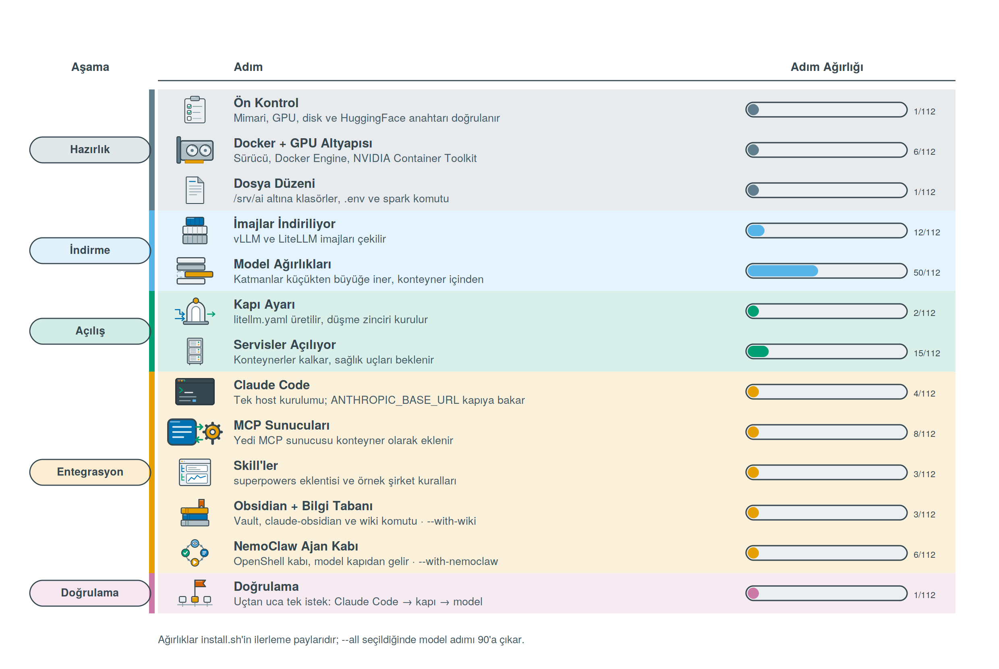

# Kurulum

DGX Spark'ta sıfırdan çalışan bir kuruluma kadar adım adım.
Üniversite hattında (1 Gbit) süreler aşağıdaki gibidir.

| Kurulum | Katmanlar | İndirme | Süre |
|---|---|---|---|
| `--demo` | haiku + sonnet | ~45 GB | 15-20 dk |
| varsayılan | + opus | ~65 GB | 30-40 dk |
| `--all` | + fable, Obsidian, Open WebUI | ~132 GB | 50-70 dk |

Süreler indirmeyi ve ilk açılıştaki GPU çekirdeği derlemesini kapsar.

> **Üçü de HuggingFace anahtarı ister.** Model ağırlıkları oradan iniyor; `--demo` bile
> anahtarsız kurulmaz. Nasıl alınacağı bir alttaki bölümde.

---

## Katmanlar ve modeller

| Katman | HuggingFace deposu | Aile | Aktif param. | Kullanım | Bellek | Port |
|---|---|---|---|---|---|---|
| `haiku` | `unsloth/Qwen3.6-35B-A3B-NVFP4` | Qwen | 3B (MoE) | Anlık cevap, commit mesajı, dosya özeti | ~25 GB | 8002 |
| `sonnet` | `nvidia/NVIDIA-Nemotron-3.5-Lightning-30B-A3B-NVFP4` + DSpark | NVIDIA | 3B (MoE) | Günlük iş, ajan döngüleri — **~108 tok/s** | ~20 GB | 8000 |
| `opus` | `unsloth/Qwen3.8-27B-NVFP4` + MTP | Qwen | 27B (dense) | Ciddi kod, ajan işleri — **varsayılan** | ~20 GB | 8888 |
| `fable` | `nvidia/NVIDIA-Nemotron-3-Super-120B-A12B-NVFP4` | NVIDIA | 12B (MoE) | En zor işler — **tek başına çalışır** | ~67 GB | 8001 |

Depolar `/srv/ai/compose/.env` içinde `HAIKU_REPO`, `SONNET_REPO`, `OPUS_REPO`, `FABLE_REPO` olarak tanımlıdır; başka bir model denemek için tek yerden değiştirilir.

Claude Code içinde `/model haiku`, `/model sonnet`, `/model opus` ile geçiş yapılır. `fable` için önce terminalde `spark up fable` — diğer katmanlar otomatik kapanır.

`--with-swap` (veya `--all`) ile kurduysan bu elle adım ortadan kalkar: `/model fable` demen yeter, llama-swap katmanı kendisi açar. Ayrıntı: [Katman değişimi](#katman-değişimi--llama-swap).

---

## Ön hazırlık: HuggingFace anahtarı

Model ağırlıkları HuggingFace'ten iniyor; ücretsiz bir erişim anahtarı gerekiyor.

1. [huggingface.co](https://huggingface.co) — hesabın yoksa üye ol
2. Sağ üst profil → **Settings** → **Access Tokens**
3. **+ Create new token** → Token type: **Read** → isim ver → **Create token**
4. `hf_` ile başlayan değeri kopyala

Script kurulum sırasında sorar; önceden vermek için `--token hf_xxx`.

> Anahtarı yapıştırdığında ekranda görünmez — güvenlik gereği gizlenir. Enter'a bas.

---

## Kurulum

```bash
git clone https://github.com/egerberkuslu/spark-stack
cd spark-stack
bash install.sh --all --token hf_xxx
```

`hf_xxx` yerine bir önceki bölümde aldığın anahtarı yaz. `--token` vermezsen kurulum ekranda
sorar; üç deneme hakkın olur ve `hf_` ile başlamayan bir değeri kabul etmez.

Yalnızca demo için (yine anahtar gerekir):

```bash
bash install.sh --demo --token hf_xxx
```

Script 13 adımda ilerler:



Model adımında hangi katmanın hangi modeli indirdiği açıkça listelenir:

```
┌─ [5/13] Model ağırlıkları
  │
  │  KATMAN  MODEL                                  BOYUT   KULLANIM
  │  ──────  ─────                                  ─────   ────────
  │  haiku   unsloth/Qwen3.6-35B-A3B-NVFP4                    ~25 GB  hızlı Qwen · anlık cevap
  │  sonnet  nvidia/NVIDIA-Nemotron-3.5-Lightning-30B-A3B-NVFP4 ~20 GB  hızlı NVIDIA · ~108 tok/s
  │  opus    unsloth/Qwen3.8-27B-NVFP4                        ~20 GB  Qwen kalite · ciddi kod
  │
  │ ✓ haiku indi — 24.9G
  │ ✓ sonnet indi — 19.6G
  │ ✓ sonnet taslak indi — spekülatif decode aktif
  │ opus ← unsloth/Qwen3.8-27B-NVFP4  (~20 GB)
└─ [████████████████············]  58%  1840s · toplam 34:12 · kalan 8 adım
```

Tüm ayrıntı `/srv/ai/install.log` dosyasına yazılır.

Kurulum kesilirse `--resume` ile kaldığı yerden devam eder; indirilmiş ağırlıklar tekrar indirilmez.

---

## Doğrulama

```bash
source ~/.bashrc
spark status
```

Beklenen çıktı:

```
  haiku    ÇALIŞIYOR  127.0.0.1:8002  unsloth/Qwen3.6-35B-A3B-NVFP4
  sonnet   ÇALIŞIYOR  127.0.0.1:8000  nvidia/NVIDIA-Nemotron-3.5-Lightning-30B-A3B-NVFP4
  opus     ÇALIŞIYOR  127.0.0.1:8888  unsloth/Qwen3.8-27B-NVFP4
  fable    kapalı     nvidia/NVIDIA-Nemotron-3-Super-120B-A12B-NVFP4
  kapı     ÇALIŞIYOR  http://localhost:4000

  GPU belleği : 78420 MiB, 122570 MiB
```

İlk kullanım:

```bash
mkdir ~/proje && cd ~/proje && claude
```

Örnek istek:

```
FastAPI ile küçük bir todo servisi yaz, pytest testlerini ekle ve çalıştırıp doğrula
```

---

## Günlük kullanım

```bash
spark status              # servis durumu, bellek, disk
spark models              # katman → model eşlemesi ve durum
spark up demo             # haiku + sonnet
spark up daily            # haiku + sonnet + opus
spark up fable            # yalnız fable
spark logs opus           # canlı log
spark ask "merhaba"       # hızlı test
spark down                # tüm servisleri durdur
```

Sonradan ekleme:

```bash
spark pull opus && spark up daily          # katman ekle
bash install.sh --with-fable --resume      # dördüncü katman
bash install.sh --with-wiki --resume       # Obsidian + bilgi tabanı
bash install.sh --with-extras --resume     # Open WebUI + Qdrant + Whisper
bash install.sh --with-nemoclaw --resume   # NemoClaw ajan kabı
bash install.sh --with-swap --resume       # llama-swap ile talep-güdümlü katman
bash install.sh --with-canvas --resume     # Agent Canvas kontrol merkezi
bash install.sh --with-a2a --resume        # A2A köprüsü (roller protokolle açılır)
bash install.sh --with-agency --resume     # katalogdan 15 uzman rol
```

---

## Katman değişimi — llama-swap

`--with-swap` (veya `--all`) ile [llama-swap](https://github.com/mostlygeek/llama-swap) kapı ile model sunucuları arasına girer. Katman elle açılmaz: istek hangi katmana geliyorsa o açılır, çakışan kapanır, boşta kalan süresi dolunca düşer.


```bash
spark up swap                 # düzeni aç
spark swap                    # hangi katman ayakta, bellek ne durumda
spark ask "merhaba" fable     # soğuk katmanı önden ısıt
```

Kurulum sonunda ana katman bir kez ısıtılır. Soğuk bir katmana ilk geçişte 3-4 dakika beklenir; bu sürede Claude Code kendi zaman aşımına takılabilir, o yüzden ilk seferi `spark ask` ile ısıtmak pratik çözümdür.

Ayarlar `/srv/ai/compose/.env` içinde: `SWAP_TTL` (boşta düşme süresi), `SWAP_TTL_FABLE` gibi katman başına süreler, `SWAP_HEALTH_TIMEOUT` (ilk açılış payı), `SWAP_BIND`.

Düzeni geri almak için `--no-swap` ile yeniden kur; kapı yeniden katmanlara doğrudan bakar.

---

## Şirket kuralları ve roller

Kurulum bilgi tabanına dört kural dosyası koyar ve makinene üç rol kurar. Kurallar taslaktır;
kendi kurallarınla değiştirmen beklenir. **Varsa üzerine yazılmaz** — `--resume` ile tekrar
çalıştırsan da düzenlediğin dosyalar korunur.

```
~/vault/kurallar/kod-standartlari.md     kod yazarken
~/vault/kurallar/test-kurallari.md       test yazarken
~/vault/kurallar/pr-kurallari.md         commit ve PR hazırlarken
~/vault/kurallar/yazim-kurallari.md      doküman, yorum, rapor yazarken
```

Roller iki yere birden kurulur, tek kaynaktan:

| Nereye | Kim okur | Model adı |
|---|---|---|
| `~/.claude/agents/` | host'taki Claude Code | `opus`, `sonnet` |
| `/srv/ai/data/canvas/agents/` | Agent Canvas (kapta `~/.openhands/agents/`) | `litellm_proxy/opus` |

Canvas her konuşma başlarken bu dizini kendiliğinden tarar; ayrıca bir kayıt adımı yok.

Kurulum, Canvas ayağa kalkınca ayar API'sinden iki şeyi tohumlar ve geri okuyup doğrular:
alt ajan devrini açar (`enable_sub_agents` — varsayılanı kapalı, kapalıyken devir aracı
yüklenmiyor) ve modeli `litellm_proxy/opus` olarak yerel kapıya bağlar. Tohumlama başarısız
olursa uyarır; o zaman panelden Settings → Agent → Sub-agents ve Settings → LLM elle yapılır.

`spark canvas` bu ayarları canlı okur, kurulu rolleri modelleriyle listeler.

`~/projects/AGENTS.md` da kurulur ve **hem Claude Code hem Canvas onu kendiliğinden okur**;
içeriği tam metin olarak sistem istemine girer. Ayrıca `kurallar/` klasörü Canvas kabına
kullanıcı skill'i olarak bağlanır (`~/.agents/skills`), böylece kurallar her konuşmada
zorunlu olarak yüklenir.

Kuralı değiştirmek için dosyayı doğrudan aç. Tek kaynak olduğu için, kaydettiğin an bütün
ajanlar yeni kurala bağlanır; yeniden kurulum gerekmez.

---

## Agent Canvas — ajan kontrol merkezi

`--with-canvas` (veya `--all`) ile kurulur. Konuşmalar, dosyalar, terminal ve otomasyonlar tek panelden yönetilir; ajan kabın içinde koşar ve yalnızca `/projects` altına bağladığın klasörü görür.

```bash
spark up canvas               # aç
spark canvas                  # adres, panel anahtarı, girilecek ayarlar
```

Panel: `http://localhost:8300/canvas` — kendi portu 8000 ama onu `sonnet` kullandığı için 8300'e taşındı.

İlk açılışta **Settings → LLM** bir kez elle doldurulur (bu ayar env değişkeniyle yapılamıyor):

| Alan | Değer |
|---|---|
| Model | `litellm_proxy/opus` |
| Base URL | `http://litellm:4000` |
| API Key | `.env` içindeki `LITELLM_KEY` |

Claude Code'u alt ajan olarak çalıştırmak için **Settings → Agent → Preset: Claude Code**. Kap zaten yerel kapıya bakacak şekilde kurulu (`ANTHROPIC_BASE_URL`). Claude aboneliğinin OAuth token'ını buraya girme — base URL ile birlikte çalışmıyor.

Proje klasörünü değiştirmek için `--projects ~/kod`.

---

## Role görev vermek ve katalog rolleri

Rolü elle atamazsın; yönlendiren ajan işi bölüp devreder. İstersen adıyla da isteyebilirsin:

```
"ödeme akışına indirim kuponu ekle, testleriyle"      → kendisi böler
"spark-kod'a devret: şu fonksiyonu yaz"               → adıyla
curl localhost:8400/agents/spark-kod/a2a/v1 ...       → protokolle
```

Canvas'ta rol listesi konuşma başında kendiliğinden yüklenir, ayrı bir seçim adımı yoktur.

`--with-agency` ile [agency-agents](https://github.com/msitarzewski/agency-agents) (MIT)
kataloğundan 15 uzman rol gelir (`ajans-` önekiyle):

```bash
spark agents --liste                 # katalogdaki bütün ajanlar
spark agents --onerilen              # seçilmiş seti kur
spark agents engineering/engineering-sre --model sonnet
```

İçe aktarıcı adı slug'a çevirir, katman adını ekler ve gövdeye şirket kurallarını bağlar.
Kendi rollerimizle çakışanlar (kod/test/denetim) bilerek dışarıda.

---

## A2A köprüsü — rolleri protokolle açmak

`--with-a2a` (veya `--all`) ile roller [Agent2Agent](https://github.com/a2aproject/A2A)
protokolüyle dışarı açılır. Canvas'ın kendi devri tek süreç içinde kalır; bu köprü sayesinde
başka bir süreçteki ya da başka makinedeki bir ajan rolleri keşfedip görev verebilir.

```bash
spark a2a                                        # kart ve roller
curl localhost:8400/.well-known/agent-card.json  # keşif
```

Bir role doğrudan görev vermek:

```bash
curl -s localhost:8400/agents/spark-kod/a2a/v1 \
  -H 'Content-Type: application/json' \
  -d '{"jsonrpc":"2.0","id":1,"method":"SendMessage",
       "params":{"message":{"role":"ROLE_USER","parts":[{"text":"toplama fonksiyonu yaz"}]}}}'
```

Köprü her isteği karşılarken `kurallar/` altındaki dosyaları sistem istemine ekler; uzaktan
gelen görev de şirket kurallarına bağlı kalır.

Başka makineden çağıracaksan `.env` içinde `A2A_BIND=0.0.0.0` ve `A2A_BASE_URL`'i gerçek
adresle güncelle. Köprüde kimlik doğrulama yok, o yüzden ağa açarken kapı gibi düşün.

---

## NemoClaw ajan kabı

`--with-nemoclaw` (veya `--all`) ile [NVIDIA NemoClaw](https://github.com/NVIDIA/NemoClaw) kurulur; ajan OpenShell sanal kabında çalışır, model yine yerel kapıdan gelir.


```bash
nemoclaw spark connect          # kaba bağlan, ajanı çalıştır
nemoclaw spark logs --follow    # canlı log
nemoclaw spark dashboard-url    # tarayıcı paneli
nemoclaw spark status           # kap, model, ağ politikası
```

Kap adını değiştirmek için `--sandbox <ad>`. Kurulum host'a yalnızca `nemoclaw` CLI'sini bırakır (Node.js ≥22.19 gerekir, yoksa NemoClaw kendi kurar); ajan ve gateway konteynerde çalışır.

---

## Obsidian + bilgi tabanı

`--with-wiki` (veya `--all`) ile kurulur:

- **Obsidian** uygulaması — ARM64 AppImage, çünkü Spark aarch64 ve resmî `.deb` yalnızca amd64 için yayınlanıyor
- **claude-obsidian** — Claude Code eklentisi + 15 Agent Skill
- Vault: `~/vault` (değiştirmek için `--vault ~/notlar`)

```bash
wiki                        # vault'ta Claude Code aç
wiki "auth kararı neydi?"   # vault'a soru sor
obsidian                    # uygulamayı aç
```

Kaynak eklemek için dosyayı `~/vault/inbox/` altına koy, `wiki` çalıştır, `/claude-obsidian:wiki-ingest` gir.

Mevcut bir Obsidian vault'un varsa script `adopt` akışını kullanır ve içeriğe dokunmaz.

---

## Sorun giderme

| Belirti | Çözüm |
|---|---|
| Servis 10 dakikadır açılmıyor | Beklenen davranış — ilk açılışta GPU çekirdekleri derleniyor. Sonraki açılışlar 3-5 dk. |
| `docker: permission denied` | `newgrp docker`, ardından `bash install.sh --resume` |
| `docker --gpus all çalışmıyor` | NVIDIA Container Toolkit eksik. Script kurmayı dener; başarısızsa `sudo nvidia-ctk runtime configure --runtime=docker && sudo systemctl restart docker` |
| Sürücü kuruldu, yeniden başlatma istendi | `sudo reboot`, sonra `cd spark-stack && bash install.sh --resume` |
| İndirme takıldı | Ctrl+C → `bash install.sh --resume`. Sürmezse `.env` içindeki `HF_WORKERS` değerini 4'e düşür. |
| Model anlamsız karakter üretiyor | `.env` içinde `VLLM_NVFP4_GEMM_BACKEND=marlin` olduğunu doğrula |
| Makine kilitlendi | Bellek taşmış. `.env` içindeki ilgili `*_MEM` değerini 0.05 düşür, `spark up daily` |
| `spark status` bellek satırı "GiB (birleşik bellek)" diyor | Beklenen. GB10'da `nvidia-smi --query-gpu=memory.*` "Not Supported" döner; `spark` `/proc/meminfo`'ya düşer. |
| Servis açılmıyor | `spark logs <katman>` |
| `/model fable` dedim, Claude Code zaman aşımına düştü | Soğuk açılış 3-4 dk. Önce `spark ask "merhaba" fable` ile ısıt, sonra geç. |
| `spark swap` "llama-swap çalışmıyor" diyor | `spark up swap`; hâlâ olmuyorsa `spark logs llamaswap` |
| Agent Canvas açılıyor ama model cevap vermiyor | Settings → LLM bir kez elle girilmeli; `spark canvas` ne yazacağını gösterir |
| Canvas logunda `permission denied` (.openhands) | `.env` içindeki `CANVAS_UID`/`CANVAS_GID` seninkiyle eşleşmiyor: `id -u`, `id -g` ile bak, düzelt, `spark up canvas` |
| llama-swap logunda `permission denied` (docker.sock) | `.env` içindeki `DOCKER_GID` host'un docker grubuyla eşleşmiyor: `getent group docker` ile bak, düzelt, `spark up swap` |
| Katman açılmıyor, llama-swap `health check timed out` diyor | `.env` içinde `SWAP_HEALTH_TIMEOUT` değerini artır (varsayılan 2100 sn), `spark up swap` |
| `nemoclaw` komutu bulunamıyor | Kurulum onu `~/.local/bin` altına koyar; yeni terminal aç ya da `export PATH="$HOME/.local/bin:$PATH"` |
| NemoClaw onboarding model doğrulamasında düşüyor | Kapı kapalı olabilir: `spark up daily`, sonra `bash install.sh --with-nemoclaw --resume` |

Ayrıntılı kayıt: `/srv/ai/install.log`

---

## Kaldırma

```bash
bash install.sh --uninstall
```

Konteynerleri, model ağırlıklarını ve `/srv/ai` dizinini siler. Vault ve proje dosyaları korunur.
