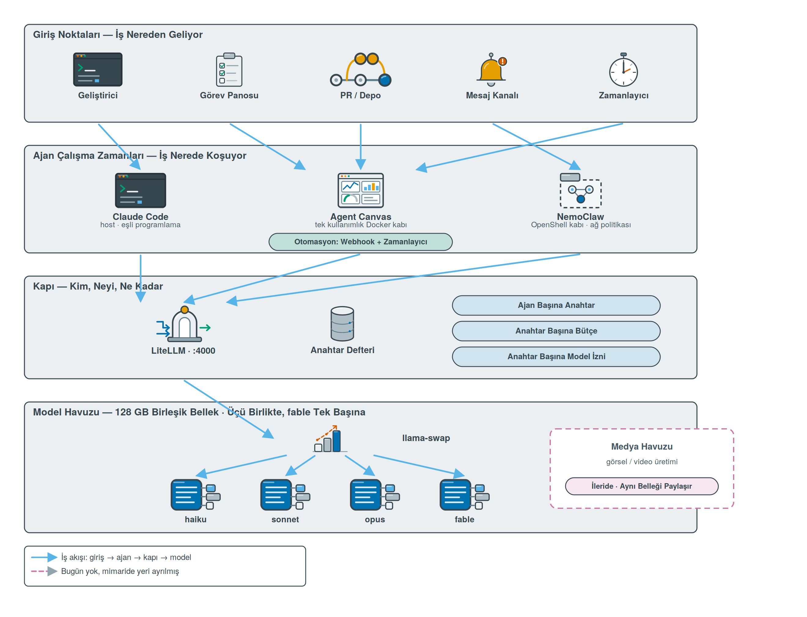
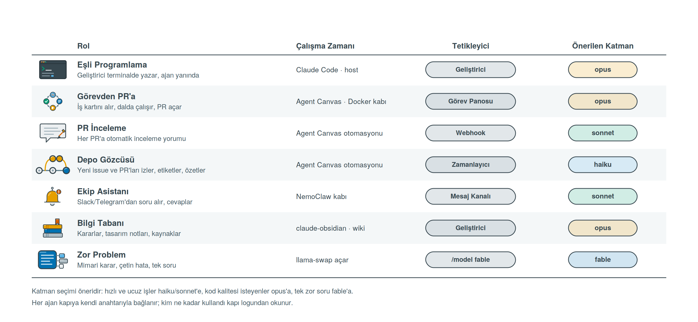
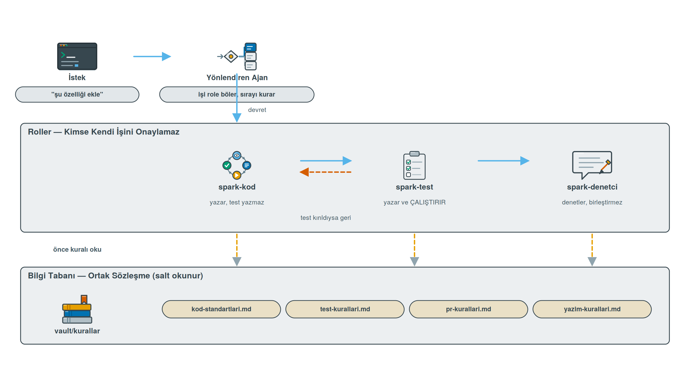

# Şirket mimarisi

Bu belge, spark-stack'in tek geliştiricinin asistanı olmaktan çıkıp bir yazılım şirketinin
işlerini yürüten ajan altyapısına dönüşürken izlenecek tasarımı anlatır. Kurulumun nasıl
yapıldığı [SETUP.md](../SETUP.md) içinde; burada **neyin neden öyle kurulduğu** var.

Çıkış noktası şu: amaç "bana kod yaz" demek değil. Amaç, şirketin tekrar eden işlerini
ajanlara devretmek. Bir ajan PR inceler, biri görev kartını alıp dalda çalışır, biri depoyu
izler, biri ekibin sorularını cevaplar. Hepsi aynı yerel model havuzundan beslenir ve hepsi
aynı kapıdan geçer.

---

## Dört katman



**Giriş noktaları.** İş nereden geliyor: geliştiricinin terminali, görev panosu, depoya
düşen PR, mesaj kanalı, ya da zamanlayıcı. Mimarinin tamamı bu beş kapıdan birinden başlar.

**Ajan çalışma zamanları.** İş nerede koşuyor. Üç ayrı kap, üç ayrı yetki seviyesi:
geliştiricinin yanında çalışan Claude Code host'ta, otomasyonlar Agent Canvas'ın tek
kullanımlık Docker kabında, dışarıya açık işler NemoClaw'ın ağ politikalı OpenShell kabında.

**Kapı.** Kim, neyi, ne kadar. Bütün model trafiği LiteLLM'den geçer; ajan başına anahtar,
anahtar başına bütçe ve model izni buradadır.

**Model havuzu.** llama-swap'in yönettiği dört katman ve 128 GB birleşik bellek. Bu katman
mimarinin tavanıdır: aşağıda anlatılan her şey bu belleğin sınırına çarpar.

---

## Ajan rolleri



Tablodaki katman seçimleri öneridir, kural değil. Mantık şu: bir işin ajan döngüsü ne kadar
uzunsa model o kadar hızlı olmalı. Depo gözcüsü günde yüzlerce kez çalışır, haiku ile
çalışır; PR incelemesi bağlam ister ama hız da ister, sonnet'e oturur; kod üreten işler
opus'a gider. fable bu tabloda bilerek yalnız bir satırda: aşağıdaki nedenle.

---

## Yönetişim: kim, neyi, ne kadar

Tek bir `master_key` ile çalışan bir kapı, tek geliştirici için yeterlidir; beş ajan için
değildir. Bu yüzden kapının bir veritabanı var (`sk-litellm-db`) ve kurulum dört anahtar
üretir: `insan`, `canvas`, `nemoclaw`, `a2a`. Her çalışma zamanı kendi anahtarıyla bağlanır.
Bunun üç karşılığı var:

**Kimlik.** Kapı logunda "sk-spark 4.2M token harcadı" değil, "PR inceleme ajanı 4.2M token
harcadı" yazar. Bir ajan çığırından çıktığında hangisi olduğunu görürsün.

**Bütçe.** Her anahtara bir tavan konur. Döngüye giren bir otomasyon, makineyi bütün gün
meşgul etmek yerine bütçesi bitince durur.

**Model izni.** Bu en önemlisi ve doğrudan donanımla ilgili: **otomasyon anahtarlarına
fable verilmez.** Nedeni şu — llama-swap'in grup kuralında fable dışlayıcıdır, açıldığında
haiku, sonnet ve opus düşer. Tek geliştirici için bu sadece bir bekleme; eş zamanlı çalışan
beş ajan için, birinin fable istemesi diğer dördünün modelini altından çeker. Bu yüzden
fable insan tarafından bilerek seçilen bir katman olarak kalmalı, bir otomasyonun
erişebileceği yerde durmamalı.

Pratikte: otomasyon anahtarlarının model listesinde fable yoktur, kapı bu isteğe 403 döner;
insan anahtarı `all-proxy-models` ile her katmana ulaşır. Otomasyon anahtarlarında ayrıca günlük
token bütçesi vardır (`OTOMASYON_GUNLUK_MTOKEN`, varsayılan 20M); bütçe dolunca kapı 429 döner ve
döngüye giren ajan durur. Yerel modelin parası olmadığı için maliyet nominal tutulur, 1 $ = 1M
token. `spark anahtarlar` harcamayı ve kalan bütçeyi gösterir; kurulumun doğrulama adımı canvas
anahtarıyla fable isteyip 403 gördüğünü raporlar.

Kurallar da yalnız istemde durmaz. Ölçülebilir olan her kural git kancasında, PR kapısında ve
CI'da mekanik olarak zorlanır; hangi kuralın nerede denetlendiği `kurallar/*.md` dosyalarının
"Mekanik denetim" bölümünde yazar. Ölçülemeyenler `spark-denetci` incelemesinde kalır.

---

## Yalıtım: bir ajan yanlış yaptığında ne olur

Üç çalışma zamanının üç ayrı hasar yarıçapı var ve bu bilinçli bir seçimdir.

Claude Code host'ta çalışır, geliştiricinin dosyalarına doğrudan erişir. Bu bir kusur değil,
eşli programlamanın gereği — ama yanında insan olduğu için kabul edilebilir.

Agent Canvas insansız işler içindir ve burada iki ayrı yalıtım seviyesi var, karıştırmamak
gerekiyor. Konteyner olarak kurduğumuzda ajan zaten Canvas kabının içinde koşar; makinenin
dosya sistemine erişemez, yalnızca kaba bağladığımız proje klasörünü görür. `rm -rf` yaparsa
kabı ve o klasörü vurur, makineyi değil. Bunun üstünde bir de **konuşma başına ayrı kap**
seçeneği var (`OH_CONVERSATION_RUNTIME=docker`); varsayılan olarak kapalıdır ve açmak için
Canvas'a docker soketini vermek gerekir. Biz kapalı bırakıyoruz: kap sınırı zaten var,
soketi vermek yalıtımı güçlendirmek yerine zayıflatırdı.

Agent Canvas'ı `npm install -g` ile doğrudan makineye kurmak ise bambaşka bir şeydir; kendi
belgelerinde "the agent will have full access to your filesystem!" uyarısı var. Biz o yolu
kullanmıyoruz.

NemoClaw dışarıya açık işler içindir: mesaj kanalından gelen isteği, ağ politikası olan bir
kapta karşılar. Dışarıdan gelen metne güvenmemek gereken tek yer burasıdır.

---

## Ajanlar nasıl işbirliği yapıyor

Ortak zemin tek başına işbirliği değildir. Aynı kapıdan geçen, aynı vault'u gören iki ajan
hâlâ birbirinden habersiz çalışabilir. İşbirliğini kuran üç şey var ve üçü de somut.



**Ortak sözleşme: kurallar vault'ta.** Kod standartları, test kuralları, PR kuralları ve
yazım kuralları `vault/kurallar/` altında dört dosyada durur. Hiçbir ajan tanımı, hiçbir
skill bu metni kopyalamaz — yalnızca yerini gösterir. Sebebi şu: kopyalanan kural eskir,
ajan tanımları birbirinden ayrışır ve bir süre sonra iki ajan farklı kurala uyar. Tek kaynak
eskimez. Bir kuralı vault'ta değiştirdiğinde host'taki Claude Code da, Canvas kabındaki ajan
da o an yeni kurala bağlanmış olur; yeniden kurulum gerekmez.

**İş bölümü: kimse kendi işini onaylamaz.** Üç rol kurulur ve her biri diğerinin yapamadığını
yapar. `spark-kod` yazar ama test yazmaz. `spark-test` testi yazar ve **çalıştırır**, çıktısını
rapora koyar; kırılan testi kendisi düzeltmez, geri devreder. `spark-denetci` değişikliğin
tamamını okur, bulgularını engelleyici / düzeltilmeli / öneri diye ayırır, PR açıklamasını
hazırlar ve orada durur — birleştirme kararı insanındır. Bu ayrım bir üslup tercihi değil:
kodu yazan, kendi varsayımını doğrulamaya eğilimlidir.

**Roller iki çalışma zamanında da tanınır.** Mekanizma tesadüf değil: Claude Code'un alt ajan
dosyaları ile OpenHands SDK'sının `AgentDefinition` dosyaları aynı biçimi kullanıyor —
YAML frontmatter artı gövde, gövde sistem istemi oluyor. Kurulum tek kaynaktan iki sürüm
üretir ve yalnızca iki alanı değiştirir: kural yolu (`~/vault/kurallar` ya da `/vault/kurallar`)
ve model adı (`opus` ya da `litellm_proxy/opus`). Host sürümü `~/.claude/agents/` altına,
Canvas sürümü kabın `~/.openhands/agents/` dizinine gider; bizde o dizin kalıcı bind mount
olduğu için `/srv/ai/data/canvas/agents/` demektir.

Canvas tarafında bunu çalışır kılan şey SDK'nın konuşma kurulumunda dosya tabanlı ajanları
kendiliğinden kaydetmesidir; proje düzeyi önce, kullanıcı düzeyi sonra taranır. Yani rol
dosyasını oraya koymak yeterli, ayrıca bir kayıt adımı yok.

**Bir anahtar var ve kurulum onu kendi açıyor.** Agent Canvas profilinde `enable_sub_agents`
varsayılan olarak kapalıdır; kapalıyken yönlendiren ajanın devir aracı hiç yüklenmez ve roller
tanınsa bile görev alamaz. Kurulum, Canvas ayağa kalkar kalkmaz
`PATCH /api/settings` ile `agent_settings_diff.enable_sub_agents` değerini açar ve aynı çağrıda
modeli kapıya bağlar. Yazdım demekle yetinmez: ayarı geri okur ve gerçekten `true` olduğunu
doğrular, olmazsa uyarıp elle yapılacak adımı yazar. `spark canvas` da bu değeri her çağrıda
canlı okur.

### Tek sürecin dışına: A2A köprüsü

Canvas'ın devir mekanizması tek süreç içinde çalışır. Ajanların ayrı süreçlerde, ayrı
makinelerde birbirini bulabilmesi için standart bir ajan-ajan protokolü gerekir ve yığındaki
hiçbir parça onu kendiliğinden konuşmuyor. OpenHands v1.19.0 kaynağında A2A'ya dair tek
eşleşme yok; SDK'da açık ama birleşmemiş bir PR var ve o da yalnız sunucu kipini kapsıyor,
istemci tarafı kapsam dışı bırakılmış. NemoClaw ise A2A'yı etkin biçimde kapatıyor: bir yama
Hermes'in A2A araçlarını söküyor ve imaj derlemesi bunun gerçekten sökülmüş olduğunu
doğruluyor. Bu yüzden protokolü rollerin önüne bir köprü koyuyor.

`--with-a2a` ile kurulan köprü rolleri [Agent2Agent](https://github.com/a2aproject/A2A)
protokolüyle yayınlar. Keşif `/.well-known/agent-card.json` adresinde (RFC 8615), gövde
JSON-RPC 2.0, metotlar `SendMessage`, `GetTask`, `ListTasks`, `CancelTask`. Bütün roller tek
kartta beceri olarak listelenir, ayrıca her rolün kendi kartı ve kendi uç noktası vardır.

Üç tasarım kararı önemli. Birincisi, köprü rol tanımlarını **aynı tek kaynaktan** okur; ayrı
bir kopya tutmaz, dolayısıyla rol değişince protokolden görünen de değişir. İkincisi, her
isteği karşılarken kuralları sistem isteminin içine ekler — uzaktan gelen bir görev de şirket
kurallarına bağlı kalır, çünkü kuralı okumak çağıranın insafına bırakılmamıştır. Üçüncüsü,
yalnız standart kütüphane kullanır: `python:3.12-alpine` imajı doğrudan koşar, kurulum adımı,
bağımlılık ve derleme yoktur.

Metot adlandırması iki sürüm arasında değişti: spesifikasyon v1.0'da `SendMessage`, v0.3'te
`message/send`. Köprü ikisini de kabul ediyor, çünkü sahadaki istemciler bölünmüş durumda ve
birini reddetmek uyumluluk kazandırmaz.

Sınırı da yazalım: köprü akış (streaming) ve itme bildirimi (push notification) sunmuyor,
kartında ikisini de `false` olarak bildiriyor. Görevler bellekte tutuluyor, yani köprü yeniden
başlarsa geçmiş görev kayıtları gider — çalışan bir iş değil, yalnızca sorgulanabilir kayıt
kaybolur.

**Kural yükleme üç koldan sağlama alındı.** Birincisi rol dosyalarının gövdesi, ikincisi
proje kökündeki `AGENTS.md` — SDK bunu `agents` adlı bir skill'e çevirip tetikleyicisiz
yüklüyor, yani tam metin her konuşmanın sistem istemine giriyor. Üçüncüsü `kurallar/`
klasörünün Canvas kabına kullanıcı skill'i olarak bağlanması (`~/.agents/skills`, salt
okunur): tetikleyicisi olmayan `.md` dosyaları da tam metin yükleniyor. Üçü birden olduğu
için kuralı okumak ajanın insafına kalmıyor.

Küçük ama önemli bir ayrıntı: `CLAUDE.md` de tanınıyor ama model ailesi Anthropic değilse
eleniyor. Yerel modellerle çalıştığımız için sözleşme `AGENTS.md` adında duruyor; o hiçbir
modele göre elenmez.

---

## Kim neyi görüyor

Parçalar birbirine bağlanırken asıl soru "hangi ajan neye erişebiliyor" olur. Tablo bugünkü
gerçeği gösterir; boş hücre eksiklik değil, bilinçli sınırdır.

| Ajan | Nerede koşar | Modele nasıl bağlanır | Dosya erişimi | Bilgi tabanı | MCP sunucuları |
|---|---|---|---|---|---|
| Claude Code | host | `ANTHROPIC_BASE_URL` → :4000 | senin bütün home'un | vault, okuma-yazma | yedisi de var |
| Agent Canvas yerleşik ajanı | canvas kabı | `litellm_proxy/...` → `litellm:4000` | yalnız `/projects` | `/vault`, salt okunur | yok |
| Claude Code (Canvas içinde, ACP) | canvas kabı | `ANTHROPIC_BASE_URL` → `litellm:4000` | yalnız `/projects` | `/vault`, salt okunur | yok |
| NemoClaw ajanı | OpenShell kabı | `inference.local` → :4000 | kabın kendi alanı | yok | yok |
| A2A köprüsü (uzak çağrı) | a2a kabı | doğrudan `litellm:4000` | yok | `/vault/kurallar`, salt okunur | yok |

Üç şeyi açıklamak gerekiyor.

**Vault neden salt okunur.** Bilgi tabanı ortak bir varlık: kararlar, tasarım notları,
kaynaklar. Bir otomasyonun yanlışlıkla silebileceği yerde durmamalı. Ajanlar notlara
bakabilir, arayabilir, alıntılayabilir; yazma işi insanın onayladığı `wiki` akışında kalır
(claude-obsidian zaten iki aşamalı onay istiyor: önce plan, sonra planın sha256'sıyla uygula).

**Kaplarda neden MCP yok.** Kurduğumuz yedi MCP sunucusunun hepsi `docker run` ile çalışıyor.
Canvas kabının içinde docker yok, olması da istenmez. Ama orada ajanın zaten yerleşik dosya ve
kabuk araçları var ve bunlar kabın sınırında duruyor — yani MCP'nin sağladığı erişimi, daha dar
bir yetkiyle, kabın kendisi veriyor. Eksik olan tek şey `context7` ve `playwright` gibi dış
servisler; onlara ihtiyaç duyan işi host'taki Claude Code'a bırakmak doğru olur.

**NemoClaw kabı vault'u görmüyor.** Bu bir eksiklik ve bilinçli: NemoClaw dışarıdan gelen
isteği karşılayan kap, yani en az güvenilen giriş noktası. Gerekirse `nemoclaw onboard` komutunun
`--host-mount <host-yolu:/kap-yolu>` seçeneği salt okunur bağlama yapıyor; ama varsayılanda
kapalı bırakıldı.

**Kurallara hangi yoldan bağlanıyorlar.** Mekanizma ortamına göre değişir, varılan yer aynıdır:
host'taki Claude Code `sirket-kurallari` skill'i ve `spark-*` rolleri üzerinden, Canvas kabındaki
ajan proje kökündeki `AGENTS.md` üzerinden. İkisi de `kurallar/` klasöründeki aynı dört dosyaya
çıkar. NemoClaw kabı vault'u görmediği için sözleşmeye bağlı değildir; oraya gönderilen iş,
kuralların uygulanmasının beklenmediği iş olmalıdır.

---

## Portlar tek makinede nasıl paylaşılıyor

Hepsi `127.0.0.1`'e bağlı. İki tanesi bilerek kaydırıldı: Agent Canvas kendi içinde 8000
dinliyor ama o portu `sonnet` tuttuğu için dışarı 8300'den açılıyor, llama-swap da 8081'e
alındı çünkü 8080 NemoClaw'ın OpenShell gateway'inin varsayılanı. Tam liste
[README'nin Portlar bölümünde](../README.md#portlar).

---

## Tek makinenin gerçeği

Bu belge şirket mantığını anlatıyor; kurulu olan tek bir makine. 128 GB birleşik bellek, tek
GPU. Günlük üç katman birlikte yaklaşık 65 GB (25 + 20 + 20), fable tek başına 67 GB; ikisi
birden sığmadığı için fable dışlayıcıdır. Bu bir araştırma laboratuvarının ölçeğidir. Doğru
okuma şu: kurallar, roller, anahtarlar ve kapı şirket ölçeğine göre kuruludur, model havuzu
tek makinedir. Tasarımın şirket mantığı taşıması kapasitenin şirket olması demek değildir.

Bunun en dürüst sonucu: **ajan sayısını artırmak iş gücünü artırmaz.** Dört katman da
aynı 128 GB'yi paylaşır. İki ajan aynı anda opus isterse ikisi de aynı vLLM örneğine düşer
ve sıraya girer; işler paralelleşmez, kuyruk uzar.

Buradan çıkan üç kural:

Otomasyonları haiku ve sonnet'e yasla. Ucuz ve hızlı katmanlar aynı anda açık durabildiği
için, eş zamanlı iki otomasyon birbirini beklemez.

Soğuk başlatmayı iş akışının içine koyma. Bir katman kapalıysa ilk istek 3-4 dakika bekler.
Zamanlayıcıyla çalışan bir otomasyon bunu her seferinde ödemesin diye, o katmanın
`SWAP_TTL` değeri otomasyonun periyodundan uzun olmalı.

fable'ı otomasyondan uzak tut. Bu artık bir tavsiye değil, anahtar düzeyinde bir yasak:
otomasyon anahtarları fable isteyince kapı 403 döner.

Gerçekten paralel iş gerekiyorsa çözüm ikinci bir Spark'tır, daha fazla ajan değil. Bunun için
hiçbir ajan, rol, kural ya da anahtar değişmez; kapı zaten bir yük dengeleyicidir. Eş makinede
llama-swap LAN'a açılır (`SWAP_BIND=0.0.0.0`), ana makinede `.env` içine
`SPARK_PEERS=spark2:8081` yazılır ve kurulum her katman için ikinci bir dağıtım ekler; aynı ad,
iki adres, kapı istekleri dağıtır. Kapının iki dağıtım arasında dağıttığı sahte arka uçla
doğrulandı; gerçek bir ikinci Spark ile henüz denenmedi. llama-swap'ın kendi kimlik doğrulaması
yoktur, bu yüzden eş makineler yalnız güvenilen ağda durur.

---

## İleride: görsel ve video modelleri

Medya üretimi mimaride yeri ayrılmış ama bugün kurulu olmayan bir katmandır. İki şeyi
şimdiden bilerek tasarlıyoruz.

Birincisi, aynı belleği paylaşacak. Bir video modeli açıldığında metin katmanlarının
düşmesi gerekecek; bu llama-swap'in grup kuralına yeni bir dışlayıcı grup eklemek demek,
mimari değişikliği değil.

İkincisi, kapıdan geçecek. Görsel üretimi sohbet tamamlama değildir, ama LiteLLM'in kendi
görsel uçları var; ajanların medya isteklerini de aynı anahtar ve bütçe defterinden geçirmek,
ayrı bir kapı açmaktan iyidir.

---

## Bugün ne var, ne yok

| Parça | Durum |
|---|---|
| Dört katman + kapı + llama-swap | Kurulu |
| Claude Code (host) | Kurulu |
| NemoClaw kabı | Kurulu — `--with-nemoclaw` |
| Obsidian bilgi tabanı | Kurulu — `--with-wiki` |
| Agent Canvas + otomasyonlar | Kurulu — `--with-canvas` |
| Kapı veritabanı + ajan başına anahtar, bütçe, model izni | Kurulu — her kurulumda |
| Kural kapısı: git kancaları, PR kapısı, CI şablonu | Kurulu — her kurulumda |
| İkinci makine (`SPARK_PEERS`) | Kapı tarafı hazır, gerçek eş makineyle denenmedi |
| Medya havuzu | Mimaride yer ayrıldı, bugün yok |

---

## Canvas → Claude Code → yerel model

Agent Canvas, Claude Code'u ACP üzerinden kendi içinde alt ajan olarak çalıştırabiliyor;
belgeli ve yayınlanmış bir özellik, sarmalayıcı imajın içinde hazır geliyor. Üst katmanda
Canvas konuşmayı, otomasyonu ve kabı yönetir; Claude Code kendi araç, bağlam ve model
işini yapmaya devam eder. Zincirin son halkası bizim kurduğumuz kısım:

```
Agent Canvas  →  Claude Code (ACP alt ajanı)  →  LiteLLM :4000  →  yerel katman
```

Bunu `ANTHROPIC_BASE_URL=http://litellm:4000` ve `ANTHROPIC_API_KEY` ile kuruyoruz; ikisi de
compose'da Canvas kabına veriliyor. Kapımız Anthropic uyumlu `/v1/messages` ucunu zaten
sunduğu için Claude Code'un kendi protokolü bozulmadan yerel modele iner. Gelen model adı
`claude-sonnet-4-5` gibi bir şey olsa bile `litellm.yaml` içindeki `claude-*` kuralı onu ana
katmana düşürür.

**Abonelik token'ı verilmez.** OpenHands belgelerinde açık uyarı var: `ANTHROPIC_BASE_URL`
ile `CLAUDE_CODE_OAUTH_TOKEN` birlikte kullanıldığında token'ın kimlik doğrulaması sessizce
bozuluyor, çünkü bearer başka bir uca yönleniyor. Kaynak kodda da bu ikisi çakışan çift
olarak işaretli. Yani ya abonelik ya yerel kapı; bu kurulumda tercih yerel kapıdır ve
`CLAUDE_CODE_OAUTH_TOKEN` bilerek boş bırakılır.

Bilinen pürüzler, bugünkü hâliyle: ACP üzerinden çalışan Claude Code, Canvas'ın yerleşik
skill'lerini göremiyor; ACP konuşmaları için duraklat/iptal yok; aynı sağlayıcıyla eş
zamanlı iki konuşma kap içinde aynı HOME'u paylaşıp yarışabiliyor. Üçü de üst akışta açık
kayıt. Tek ajanla çalışırken sorun çıkarmıyor.
